I wanted my own place for Git repos, CI pipelines and packages, running on my own cluster. GitHub and GitLab are fine, but for a homelab or a test cluster they felt like too much, and I wanted something I could fully control. Gitea turned out to be a really good fit.

This post builds the whole thing from an empty cluster: Gitea, a runner for CI jobs, users, an organization with teams, and a real Python service whose pipeline tests it, publishes it to PyPI, builds a container image from that package and pushes a Helm chart. Then we install the app on Kubernetes straight from Gitea's registries.

It's a simple setup: one Gitea pod, one runner, no high availability. That's on purpose, so we can focus on how Gitea works. I explain every command, flag and YAML line, so feel free to skip the parts you already know.

---

## What we'll end up with

- **Gitea** in a single pod, with the web UI, Git over HTTPS and Git over SSH. Everything it stores lives on one persistent volume.
- **A runner** in its own namespace that picks up CI jobs and runs them in containers. It can build and push images too.
- **People and ownership done properly:** a human user, a bot user for CI, an `acme-corp` organization and two teams with different permissions.
- **A repo called `backend-api`** with a small FastAPI service, its tests, a Dockerfile and a Helm chart.
- **A pipeline** that runs the tests on every push, and on a version tag publishes a Python package, a container image and a Helm chart to Gitea.
- **The app running in the cluster**, installed from the Helm chart in Gitea and running the image from Gitea.

Here's how it fits together:

```
                          +-----------------------------------------------------------+
                          |                     Kubernetes cluster                    |
                          |                                                           |
 browser / git / docker   |  namespace: gitea                                         |
 pip / helm               |  +-------------------------------+     +--------------+   |
 ------------------------>|  | Pod: gitea                    |---->| PVC (5Gi)    |   |
   https://<your-url>     |  |  web UI, API, Git (HTTP/SSH)  |     | repos, db,   |   |
   (NodePort 30300)       |  |  Actions (CI scheduler)       |     | packages     |   |
                          |  |  Packages: PyPI, container,   |     +--------------+   |
                          |  |  Helm (OCI)                   |                        |
                          |  +---------------^---------------+                        |
                          |                  | asks for jobs                          |
                          |  namespace: gitea-runner                                  |
                          |  +---------------+--------------------------------+       |
                          |  | Pod: gitea-runner-runner-0                     |       |
                          |  |  runner container  ->  dind container (Docker) |       |
                          |  |                         job containers run here|       |
                          |  +------------------------------------------------+       |
                          |                                                           |
                          |  namespace: demo                                          |
                          |  +--------------------------+                             |
                          |  | Deployment: backend-api  |  image + chart from Gitea   |
                          |  +--------------------------+                             |
                          +-----------------------------------------------------------+
```

---

## Gitea concepts, explained

These words come up all the time. I've grouped them, because it's easier to remember them that way.

**The platform**

| Term | What it means |
|---|---|
| **Gitea** | A self-hosted Git service written in Go. Repos, pull requests, issues, CI and package registries all come from one small binary. |
| **`app.ini`** | Gitea's config file. The Helm chart writes it for you from the `gitea.config` part of your values file. |
| **ROOT_URL** | The public address of your Gitea, like `https://git.example.com/`. Clone URLs, links and the registry login all come from it, so it has to be right. |
| **Site administrator** | A user who can manage the whole instance. The chart creates the first one, `gitea_admin`. |

**People and ownership**

| Term | What it means |
|---|---|
| **User** | A normal account for a person. It can own repos and packages, but for team work that's rarely what you want. |
| **Bot user** | A user of type `bot`, meant for automation. It can't log in to the web UI and has no password; it works only with tokens. |
| **Organization** (org) | A shared owner for repos and packages, like a team or company. Things it owns keep working when a person leaves. |
| **Team** | A group of users inside an org with a set of permissions. Every org starts with an **Owners** team that can do everything. |
| **Unit permissions** | What a team can do per area of a repo: Code, Issues, Pull Requests, Releases, Wiki, Projects, Packages and Actions. Each is set to no access, read or write. |
| **Collaborator** | A user added to one single repo directly. It works, but teams scale better. |
| **Visibility** | Public (anyone), limited (signed-in users) or private (members only). Repos, users and orgs each have their own. |

**Gitea Actions (CI)**

| Term | What it means |
|---|---|
| **Gitea Actions** | Gitea's built-in CI/CD. It uses the GitHub Actions workflow syntax. |
| **Workflow** | A YAML file in `.gitea/workflows/`. It says when to run and what to run. |
| **Event** (trigger) | What starts a workflow: a push, a pull request, a tag, a schedule or a button click. |
| **Job** | A group of steps that runs together on one runner, in one container. Jobs run in parallel unless one `needs` another. |
| **Step** | One command (`run:`) or one reusable action (`uses:`) inside a job. Steps run in order. |
| **Action** | A reusable step, like `actions/checkout@v4`. Gitea fetches it from GitHub or from your own Gitea. |
| **Runner** | The program that actually runs jobs. It keeps asking Gitea for work, and Gitea never runs jobs itself. |
| **Runner label** | A name the runner offers, like `ubuntu-latest`. A job's `runs-on` picks a runner by label. |
| **Runner scope** | Who a runner works for: the whole instance, one org or one repo. It's decided by the registration token you give it. |
| **Secret** | A value only workflows can read, like a token. It's write-only in the UI and masked in logs. |
| **Variable** | A plain value for workflows, like a hostname. Anyone with access can read it. |
| **Job token** | A short-lived token Gitea gives every job automatically. `actions/checkout` uses it to clone private repos. |

**Packages**

| Term | What it means |
|---|---|
| **Package registry** | Gitea's built-in store for build output: PyPI, container images, Helm charts, npm, Maven and more. |
| **Package owner** | Every package belongs to a user or an org, never to a repo. Its visibility comes from its owner. |
| **Repository link** | An optional link from a package to a repo, so it shows up on the repo's Packages tab. |
| **Personal access token** (PAT) | A password-like token with limited **scopes**, like `write:package`. CI uses one instead of a real password. |

---

## What you need before starting

- **A Kubernetes cluster.** I used [iximiuz Labs](https://labs.iximiuz.com): a K3s playground with one control plane and three workers, ready in the browser in seconds. Any cluster works, even a single node.
- **`kubectl` and `helm` in a terminal,** with Helm 3.8 or newer for OCI support. On iximiuz Labs I ran everything in the `cplane-01` terminal, except `labctl`, which runs on your own computer.
- **A default StorageClass** for Gitea's volume. K3s ships `local-path`, and `kubectl get storageclass` shows what you have.
- **An HTTPS URL that reaches Gitea.** Docker, pip and Helm all expect the registries behind HTTPS. We'll get one from iximiuz Labs in Step 3; on your own cluster an Ingress with a real certificate does the same job.

Here's the cluster I started with:

```console
$ kubectl get nodes
NAME        STATUS   ROLES           AGE   VERSION
cplane-01   Ready    control-plane   34s   v1.36.4+k3s1
node-01     Ready    <none>          25s   v1.36.4+k3s1
node-02     Ready    <none>          24s   v1.36.4+k3s1
node-03     Ready    <none>          24s   v1.36.4+k3s1

$ kubectl get storageclass
NAME                   PROVISIONER             RECLAIMPOLICY   VOLUMEBINDINGMODE      ALLOWVOLUMEEXPANSION   AGE
local-path (default)   rancher.io/local-path   Delete          WaitForFirstConsumer   false                  29s

$ helm version --short
v4.3.0+gbec5b06
```

- All four nodes are `Ready`. `cplane-01` runs the control plane and the three `node-*` machines are workers.
- `local-path` is marked `(default)`, so Gitea's volume will come from it without us naming it anywhere.

These are the versions I used:

| Component | Version |
|---|---|
| Kubernetes | K3s v1.36.4 |
| Helm | v4.3.0 |
| Gitea Helm chart (`gitea/gitea`) | 12.7.0, installs Gitea 1.27.0 |
| Runner Helm chart (`gitea/actions`) | 0.1.2, ships gitea-runner 2.0.1 and `docker:29.5.2-dind` |
| tea (Gitea CLI) | 0.16.0 |
| Python in the app and CI | 3.13 |

---

## Helm in two minutes

We use Helm three ways in this post: to install Gitea, to install the runner, and to package our own app. These are the words you need:

| Term | What it means |
|---|---|
| **Chart** | A package of Kubernetes YAML templates plus default settings. |
| **Values** | The settings you pass to a chart, usually in a `values.yaml` file. They fill in the templates. |
| **Release** | One installed copy of a chart in a cluster, with a name like `gitea`. |
| **Chart repository** | An HTTPS site that serves charts, added with `helm repo add`. Gitea's own charts come from one. |
| **OCI registry** | A container registry that can also store charts. We'll push our app's chart to Gitea's and install it with an `oci://` URL. |

---

## Step 1: Add the Gitea Helm repo

```console
$ helm repo add gitea https://dl.gitea.com/charts/
"gitea" has been added to your repositories

$ helm repo update
Hang tight while we grab the latest from your chart repositories...
...Successfully got an update from the "gitea" chart repository
Update Complete. ⎈Happy Helming!⎈

$ helm search repo gitea/
NAME         	CHART VERSION	APP VERSION	DESCRIPTION
gitea/actions	0.1.2        	0.261.3    	Gitea Actions Helm chart for Kubernetes
gitea/gitea  	12.7.0       	1.27.0     	Gitea Helm chart for Kubernetes
```

- `helm repo add gitea https://dl.gitea.com/charts/` registers Gitea's official chart repo under the short name `gitea`. From now on its charts are `gitea/<name>`.
- `helm repo update` downloads the latest list of charts from every repo you've added. Run it before an install so you don't pick a stale version.
- `helm search repo gitea/` lists the charts: `gitea/gitea` for the server and `gitea/actions` for the runner. `CHART VERSION` is the chart's own version and `APP VERSION` is what it installs.
- Ignore the runner chart's `0.261.3`. It's old metadata; the chart really runs gitea-runner 2.0.1, as the runner log shows later.

---

## Step 2: Create two namespaces

```console
$ kubectl create namespace gitea
namespace/gitea created

$ kubectl create namespace gitea-runner
namespace/gitea-runner created
```

- `gitea` holds the server and its volume. A namespace is like a folder for Kubernetes objects, and it makes cleanup easy.
- `gitea-runner` holds the runner. Runners execute whatever code people push, so I keep them apart from Gitea itself.

---

## Step 3: Get a public HTTPS URL first

Gitea needs to know its own address before it's installed, because `ROOT_URL` goes into the config. So I get the URL first.

Gitea's web port will be NodePort `30300`. On iximiuz Labs one command turns it into a public HTTPS URL:

```console
$ labctl expose port <playground-id> 30300 --machine cplane-01 --public
```

- `labctl` is the iximiuz Labs CLI. You run it on your own computer after a one-time `labctl auth login`, and `<playground-id>` is in the playground's URL or in `labctl playground list`.
- `30300` is the port to publish. Nothing listens there yet, and that's fine; the URL starts working once Gitea is up.
- `--machine cplane-01` picks the node to send traffic to. A NodePort is open on every node, so any node works.
- `--public` lets anyone reach the URL, not just your logged-in browser. `git`, `docker`, `pip` and `helm` can't log in to iximiuz, so they need this.

It prints the URL, something like `https://6abf...-1c9601.node-eu-14f6.iximiuz.com`. TLS is handled by iximiuz, so Gitea can keep serving plain HTTP behind it. The **Expose Port** button at the top right of a running playground does the same thing.

The SSH port (`30222`) can't be exposed this way, since iximiuz only proxies HTTP. It stays reachable inside the playground, and HTTPS works for everything else.

From here on I'll write the URL as `https://git.example.com`, so swap in yours.

---

## Step 4: Put the admin password in a Secret

```console
$ kubectl --namespace gitea create secret generic gitea-admin \
  --from-literal=username=gitea_admin \
  --from-literal=password="$(openssl rand -base64 24 | tr --delete --complement 'A-Za-z0-9' | head --bytes=20)"
secret/gitea-admin created
```

- `kubectl --namespace gitea create secret generic gitea-admin` creates a Secret called `gitea-admin`. "Generic" means plain key and value pairs.
- `--from-literal=username=gitea_admin` adds the `username` key. The chart names the admin account after it.
- `--from-literal=password="$(...)"` adds a random password, generated on the spot. You never type or paste it.
- `openssl rand -base64 24` makes 24 random bytes as text (`-base64` has no long form). `tr --delete --complement 'A-Za-z0-9'` removes everything except letters and digits, and `head --bytes=20` keeps 20 characters.

To read the password later:

```console
$ kubectl --namespace gitea get secret gitea-admin --output=jsonpath='{.data.password}' | base64 --decode
```

- `--output=jsonpath='{.data.password}'` prints just that field. Secret values are stored base64 encoded, so `base64 --decode` turns it back into the real password.

---

## Step 5: Write the Gitea values file

Save this as `gitea-values.yaml`, with your URL from Step 3 in `ROOT_URL` and `DOMAIN`:

```yaml
replicaCount: 1
strategy:
  type: Recreate

service:
  http:
    type: NodePort
    clusterIP: ""
    port: 3000
    nodePort: 30300
  ssh:
    type: NodePort
    clusterIP: ""
    port: 22
    nodePort: 30222

persistence:
  enabled: true
  size: 5Gi
  storageClass: local-path

postgresql-ha:
  enabled: false
postgresql:
  enabled: false
valkey-cluster:
  enabled: false
valkey:
  enabled: false

gitea:
  admin:
    existingSecret: gitea-admin
    email: gitea-admin@gitea.local
    passwordMode: initialOnlyNoReset
  config:
    server:
      ROOT_URL: https://git.example.com/
      DOMAIN: git.example.com
      SSH_DOMAIN: 172.16.0.2
      SSH_PORT: 30222
      SSH_LISTEN_PORT: 2222
    database:
      DB_TYPE: sqlite3
    cache:
      ADAPTER: memory
    session:
      PROVIDER: db
    queue:
      TYPE: level
    indexer:
      ISSUE_INDEXER_TYPE: bleve
      REPO_INDEXER_ENABLED: false
    packages:
      ENABLED: true
    actions:
      ENABLED: true
      DEFAULT_ACTIONS_URL: github
    service:
      DISABLE_REGISTRATION: true
      REQUIRE_SIGNIN_VIEW: false
    repository:
      DEFAULT_PRIVATE: private
    security:
      INSTALL_LOCK: true

resources:
  requests: { cpu: 100m, memory: 256Mi }
  limits:   { memory: 1Gi }
```

### Replicas and updates

- `replicaCount: 1` runs one Gitea pod. We use SQLite on one volume, and two pods writing to it would corrupt it.
- `strategy.type: Recreate` stops the old pod before starting a new one on upgrades. The default rolling update starts the new pod first, which can't work when only one pod can mount the volume.

### Services

- `service.http.type: NodePort` opens the web port on every node. That's what the public URL points at.
- `service.http.clusterIP: ""` is easy to miss. The chart defaults to a headless Service (`clusterIP: None`), and Kubernetes doesn't allow a headless NodePort, so we clear it.
- `service.http.port: 3000` is the port inside the cluster. The runner talks to Gitea at `http://gitea-http.gitea.svc.cluster.local:3000`.
- `service.http.nodePort: 30300` pins the node port. It must be between 30000 and 32767 and match the port from Step 3.
- `service.ssh` does the same for Git over SSH on `30222`, and needs the same `clusterIP: ""` fix.

### Storage

- `persistence.enabled: true` gives Gitea a PersistentVolumeClaim. Without it, every restart would wipe your repos and packages.
- `persistence.size: 5Gi` is the volume size. Repos, the database and every package you push live here.
- `persistence.storageClass: local-path` picks the storage class. Leave it out to use the cluster default.

### Switching off the extras

- `postgresql-ha` and `postgresql` are off. By default the chart installs a whole HA PostgreSQL cluster, and we're using SQLite.
- `valkey-cluster` and `valkey` are off too. Valkey is a Redis-compatible cache, and a single pod doesn't need one.

With those four off, the install is **one pod**. The defaults would give you around seven.

### Admin account

- `gitea.admin.existingSecret: gitea-admin` reads the admin username and password from the Secret in Step 4. They never appear in this file.
- `gitea.admin.email` is the admin's address. Gitea requires one, but it doesn't need to be a real mailbox.
- `gitea.admin.passwordMode: initialOnlyNoReset` sets the password only when the account is created. If you change it later in the UI, an upgrade won't put the old one back.

### `gitea.config`: Gitea's own settings

Everything here ends up in `app.ini`. Each key is a section of that file, and the keys inside are its settings.

- `server.ROOT_URL` is your public HTTPS address, with the trailing slash. Clone URLs, links and the registry login are all built from it.
- `server.DOMAIN` is just the hostname, without `https://`.
- `server.SSH_DOMAIN` is the host shown in SSH clone URLs. `172.16.0.2` is my control plane's IP (`kubectl get nodes --output=wide` shows yours), because SSH only works inside the playground.
- `server.SSH_PORT: 30222` is the port shown in SSH clone URLs. It matches the SSH NodePort, so copied clone commands work.
- `server.SSH_LISTEN_PORT: 2222` is where Gitea's SSH server listens inside the pod. The image runs as a non-root user, and non-root processes can't use port 22.
- `database.DB_TYPE: sqlite3` keeps the database in one file on the volume. It needs no extra pod and is plenty for a small team.
- `cache.ADAPTER: memory` keeps the cache in Gitea's own memory. With one pod there's nothing to share it with.
- `session.PROVIDER: db` stores logins in the database, so people stay logged in across restarts.
- `queue.TYPE: level` keeps background job queues in LevelDB files on the volume. It's built in and needs no setup.
- `indexer.ISSUE_INDEXER_TYPE: bleve` uses the built-in Bleve library for issue search. `indexer.REPO_INDEXER_ENABLED: false` turns code search off, because it costs CPU and disk.
- `packages.ENABLED: true` turns on the package registries: PyPI, containers, Helm and the rest.
- `actions.ENABLED: true` turns on Gitea Actions. Without it runners can't register and workflows never run.
- `actions.DEFAULT_ACTIONS_URL: github` makes `uses: actions/checkout@v4` come from GitHub. All the usual community actions just work.
- `service.DISABLE_REGISTRATION: true` stops people from signing themselves up. Only an admin creates accounts, which matters on a public URL.
- `service.REQUIRE_SIGNIN_VIEW: false` lets anyone browse public content without logging in. Set it to `true` to hide everything behind a login.
- `repository.DEFAULT_PRIVATE: private` makes new repos private unless you say otherwise.
- `security.INSTALL_LOCK: true` skips the web installer. The chart already gives Gitea a full config, and an open installer on a public URL would be dangerous.

### Resources

- `resources.requests` reserves a tenth of a CPU and 256 MiB for Gitea. It's a light app.
- `resources.limits.memory: 1Gi` caps memory so a runaway pod gets restarted instead of hurting the node. I left out a CPU limit, because those mostly cause throttling.

---

## Step 6: Install Gitea

```console
$ helm upgrade --install gitea gitea/gitea --version 12.7.0 \
  --namespace gitea --values gitea-values.yaml --wait --timeout 10m
Release "gitea" does not exist. Installing it now.
NAME: gitea
LAST DEPLOYED: Fri Oct  2 03:28:23 2026
NAMESPACE: gitea
STATUS: deployed
REVISION: 1
DESCRIPTION: Install complete
```

- `helm upgrade --install` installs the release if it's new and upgrades it if it exists. The same command works for every change you make later.
- `gitea` is the release name and `gitea/gitea` is the chart. The release name shows up in object names, like the `gitea-http` Service.
- `--version 12.7.0` pins the chart so the next install behaves the same. `--namespace gitea` installs into our namespace, and `--values gitea-values.yaml` applies our settings.
- `--wait` waits until the pods are ready, so problems show up right away. `--timeout 10m` allows time for the first image pull.

Helm also prints two warnings, about the `memory` cache and the `leveldb` queue not being meant for production. That's expected for a single pod.

```console
$ kubectl --namespace gitea get pods,svc,pvc
NAME                         READY   STATUS    RESTARTS   AGE
pod/gitea-7685bf8fcf-2tzpc   1/1     Running   0          28s

NAME                 TYPE       CLUSTER-IP      EXTERNAL-IP   PORT(S)          AGE
service/gitea-http   NodePort   10.43.92.127    <none>        3000:30300/TCP   28s
service/gitea-ssh    NodePort   10.43.128.226   <none>        22:30222/TCP     28s

NAME                                         STATUS   VOLUME                                     CAPACITY   ACCESS MODES   STORAGECLASS   VOLUMEATTRIBUTESCLASS   AGE
persistentvolumeclaim/gitea-shared-storage   Bound    pvc-892be412-01f8-42f7-95de-887b48188cc4   5Gi        RWO            local-path     <unset>                 28s
```

- Exactly one pod, `Running` and `1/1` ready. No database or cache pods, as planned.
- `gitea-http` maps 3000 to node port `30300`, and `gitea-ssh` maps 22 to `30222`.
- The PVC is `Bound` to a 5 GiB volume. `RWO` (ReadWriteOnce) means one node at a time, which is why we use `Recreate`.

---

## Step 7: Make sure it all works

```console
$ curl --silent http://172.16.0.2:30300/api/healthz
{
  "status": "pass",
  "description": "Gitea: Git with a cup of tea",
  "checks": {
    "database:ping": [ { "status": "pass", "time": "2026-10-02T03:30:17Z" } ],
    "cache:ping": [ { "status": "pass", "time": "2026-10-02T03:30:17Z" } ]
  }
}

$ curl --silent https://git.example.com/api/v1/version
{"version":"1.27.0"}

$ curl --silent --output /dev/null --write-out '%{http_code}\n' https://git.example.com/v2/
401

$ ssh-keyscan -p 30222 172.16.0.2
# 172.16.0.2:30222 SSH-2.0-Go
[172.16.0.2]:30222 ssh-rsa AAAAB3NzaC1yc2EAAAADAQABAAACAQDOdgP10qIPkgoi0nZiOoWg...
[172.16.0.2]:30222 ecdsa-sha2-nistp256 AAAAE2VjZHNhLXNoYTItbmlzdHAyNTYAAAAIbmlz...
[172.16.0.2]:30222 ssh-ed25519 AAAAC3NzaC1lZDI1NTE5AAAAIEpigBPXK4aNOA7Bj5q282b0...
```

- The node IP checks only work inside the cluster network, so I ran them on `cplane-01`. `--silent` hides curl's progress bar.
- `/api/healthz` is Gitea's health check, hit straight on the NodePort. Both the database and the cache report `pass`.
- `/api/v1/version` goes through the public URL. A version number means iximiuz's proxy and Gitea are connected.
- `/v2/` is the container registry's endpoint. `--output /dev/null` drops the body, `--write-out '%{http_code}\n'` prints only the status, and `401` is good: the registry is up and wants a login.
- `ssh-keyscan -p 30222` asks the SSH port for its host keys without logging in (`-p` has no long form). The `SSH-2.0-Go` banner is Gitea's built-in SSH server.

One more check saves a lot of trouble later:

```console
$ curl --silent --dump-header - --output /dev/null https://git.example.com/v2/ | grep --ignore-case www-authenticate
www-authenticate: Bearer realm="https://git.example.com/v2/token",service="container_registry",scope="*"
```

- `--dump-header -` prints the response headers, and `grep --ignore-case` keeps the one we want.
- The `realm` must be your public HTTPS URL. If it isn't, `ROOT_URL` is wrong and every `docker login` will fail.

Now open your URL and log in as `gitea_admin` with the password from Step 4.

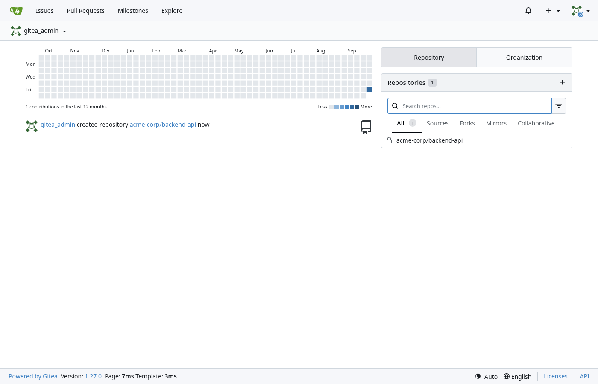

---

## How a runner runs jobs: three modes

Before installing the runner, it helps to know *where* job steps run. There are three ways, and the mode comes from the runner's labels, not from a global switch.

```
 Docker mode                     Docker-in-Docker mode               Host mode
 +----------------------+        +------------------------------+     +---------------------+
 | node                 |        | runner pod                   |     | runner machine      |
 |  runner              |        |  runner container            |     |  runner             |
 |    | docker.sock     |        |    | TCP + TLS               |     |   runs the steps    |
 |    v                 |        |    v                         |     |   directly with the |
 |  node's Docker       |        |  dind container (dockerd)    |     |   tools installed   |
 |  daemon -> job       |        |    -> job containers         |     |   there             |
 |  containers          |        |                              |     |                     |
 +----------------------+        +------------------------------+     +---------------------+
```

- **Docker mode** runs each job in a fresh container on the machine's own Docker daemon. Jobs are isolated from each other, but they share one daemon, and the runner needs its socket.
- **Docker-in-Docker (dind) mode** runs a private Docker daemon in a container next to the runner. Job containers live inside it, which isolates them from the node, but the dind container must be privileged.
- **Host mode** runs steps directly on the runner's machine or container. It's simple and fast, but jobs aren't isolated, and one job can leave a mess for the next.
- **The label decides.** `ubuntu-latest:docker://<image>` means "run in a container from that image", and `my-label:host` means "run right here". One runner can offer both.

| | Docker | Docker-in-Docker | Host |
|---|---|---|---|
| Where steps run | Container on the node's Docker | Container inside a private dockerd | Directly on the runner |
| Isolation | Good, one shared daemon | Strong | None |
| Needs | `/var/run/docker.sock` | A privileged dind container | Tools on the runner |
| Label | `name:docker://<image>` | `name:docker://<image>` | `name:host` |
| On Kubernetes | Poor: nodes run containerd, not Docker | Good: the chart's default | Fine for trusted, simple jobs |

Kubernetes nodes usually run containerd, so there's no Docker socket to share. **Docker-in-Docker is the practical choice**, and it's what the official chart sets up.

---

## Step 8: Get a runner registration token

```console
$ TOKEN=$(kubectl --namespace gitea exec deploy/gitea --container gitea -- \
  gitea actions generate-runner-token)
$ kubectl --namespace gitea-runner create secret generic gitea-runner-token \
  --from-literal=token="$TOKEN"
secret/gitea-runner-token created
```

- `kubectl --namespace gitea exec deploy/gitea --container gitea --` runs a command inside the Gitea pod. `deploy/gitea` finds the pod for us.
- `gitea actions generate-runner-token` is Gitea's admin CLI. It prints a token a runner can use to register.
- `TOKEN=$(...)` keeps it in a shell variable, so it never lands in a file. The second command stores it in a Secret under the key `token`.

The token also decides the **runner scope**:

| Command | Scope | Use it for |
|---|---|---|
| `gitea actions generate-runner-token` | Whole instance | One shared runner pool for everyone (what we do here) |
| `gitea actions generate-runner-token --scope acme-corp` | One org | Runners only that org's repos can use |
| `gitea actions generate-runner-token --scope acme-corp/backend-api` | One repo | Special hardware or secrets for a single repo |

---

## Step 9: Write the runner values file

Save this as `runner-values.yaml`:

```yaml
enabled: true
giteaRootURL: http://gitea-http.gitea.svc.cluster.local:3000
existingSecret: gitea-runner-token
existingSecretKey: token

statefulset:
  replicas: 1
  persistence:
    size: 1Gi
  runner:
    config: |
      log:
        level: info
      runner:
        capacity: 2
        labels:
          - "ubuntu-latest:docker://docker.gitea.com/runner-images:ubuntu-latest"
          - "ubuntu-24.04:docker://docker.gitea.com/runner-images:ubuntu-24.04"
      cache:
        enabled: false
      container:
        require_docker: true
        docker_timeout: 300s
        privileged: false
  dind:
    extraArgs:
      - --mtu=1450
      - --default-network-opt=bridge=com.docker.network.driver.mtu=1450
```

### The top part

- `enabled: true` must be set, or the chart creates nothing.
- `giteaRootURL` is the internal Service address, so runner traffic stays inside the cluster.
- `existingSecret` and `existingSecretKey` point at the Secret and key from Step 8.

### The StatefulSet

- `statefulset.replicas: 1` gives us one runner pod. It's a StatefulSet because each runner keeps its identity on its own volume.
- `statefulset.persistence.size: 1Gi` holds that identity file, `.runner`. Without it, every restart registers a new runner and leaves a dead one behind.

### The runner's own config

Everything after `config: |` is the runner's `config.yaml` as one block of text. The `|` keeps the line breaks.

- `log.level: info` keeps the log readable. The chart's default is `debug`.
- `runner.capacity: 2` lets it run two jobs at once. Each job starts its own containers, so keep this low on small nodes.
- `runner.labels` lists the labels as `name:docker://image`. A job with `runs-on: ubuntu-latest` runs in `docker.gitea.com/runner-images:ubuntu-latest`, Gitea's official job image with Node.js, Git and the Docker CLI.
- `cache.enabled: false` turns off the cache server used by `actions/cache`. I kept the setup minimal.
- `container.require_docker: true` makes the runner wait for the dind daemon before taking jobs, and `docker_timeout: 300s` is how long it waits.
- `container.privileged: false` keeps job containers unprivileged. Only the dind container itself is privileged.

### The MTU fix for Docker-in-Docker

- `statefulset.dind.extraArgs` adds flags to the dind container's Docker daemon. These two make every Docker network use an MTU of 1450.
- **Why it matters:** the pod network here (flannel with VXLAN) has an MTU of 1450, but Docker creates job networks with 1500. Packets that are too big can get stuck, and large HTTPS downloads inside jobs just hang.
- **I hit this for real.** Without the fix, the step that downloads Helm in my pipeline hung until it failed with `ECONNRESET`, while small downloads worked fine. That makes it a confusing one to debug.
- `--mtu=1450` sets the default bridge network, and `--default-network-opt=bridge=com.docker.network.driver.mtu=1450` sets every network created later, including the one the runner makes for each job. Check your own pod MTU first; 1450 is right for flannel VXLAN.

### Things the chart adds for you

- A `docker:dind` container next to the runner. That's the Docker daemon your jobs run in.
- That container runs privileged, because a Docker daemon can't create containers otherwise. It's the main security trade-off here, and the reason the runner has its own namespace.
- An init container that waits until `giteaRootURL` answers, so the runner doesn't crash when Gitea is down.

---

## Step 10: Install the runner

```console
$ helm upgrade --install gitea-runner gitea/actions --version 0.1.2 \
  --namespace gitea-runner --values runner-values.yaml --wait --timeout 10m
Release "gitea-runner" does not exist. Installing it now.
NAME: gitea-runner
NAMESPACE: gitea-runner
STATUS: deployed
REVISION: 1
DESCRIPTION: Install complete

$ kubectl --namespace gitea-runner get pods
NAME                    READY   STATUS    RESTARTS   AGE
gitea-runner-runner-0   2/2     Running   0          31s

$ kubectl --namespace gitea-runner logs gitea-runner-runner-0 --container runner --tail=5
level=info msg="Runner registered successfully."
SUCCESS
time="2026-10-02T03:29:24Z" level=info msg="Starting runner daemon"
time="2026-10-02T03:29:24Z" level=info msg="Docker is ready"
time="2026-10-02T03:29:24Z" level=info msg="runner: gitea-runner-runner-0, with version: v2.0.1, with labels: [ubuntu-latest ubuntu-24.04], declare successfully"
```

- `gitea-runner` is the release name and `gitea/actions` is the runner chart. The other flags work as in Step 6.
- `2/2` ready means both containers are up: the runner and its dind sidecar.
- `logs ... --container runner` picks the runner container out of the two, and `--tail=5` shows the last five lines. `Runner registered successfully`, `Docker is ready` and the label list mean it's working.

Let's also confirm the MTU fix took effect:

```console
$ kubectl --namespace gitea-runner exec gitea-runner-runner-0 --container dind -- \
  cat /sys/class/net/eth0/mtu
1450

$ kubectl --namespace gitea-runner exec gitea-runner-runner-0 --container dind -- \
  sh -c 'docker network create mtu-check >/dev/null &&
         docker network inspect mtu-check --format "{{json .Options}}" &&
         docker network rm mtu-check >/dev/null'
{"com.docker.network.driver.mtu":"1450"}
```

- The first command reads the pod's network MTU: 1450.
- The second creates a throwaway Docker network inside dind, prints its options and deletes it. New networks now get 1450 too, so job containers match the pod network.

The runner also shows up under **Site Administration → Actions → Runners**:

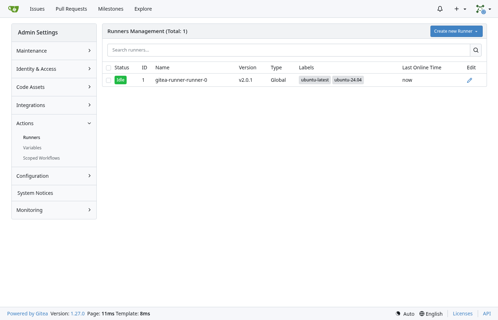

---

## Step 11: Create users for people and for CI

Two accounts: one for a person, and one for pipelines. I use Gitea's admin CLI inside the pod.

```console
$ kubectl --namespace gitea exec deploy/gitea --container gitea -- \
  gitea admin user create --username unni-p --email unni-p@acme-corp.local \
  --fullname "Unni P" --random-password --must-change-password
generated random password is '<redacted>'
New user 'unni-p' has been successfully created!
```

- `gitea admin user create` creates an account directly in the database. `--username`, `--email` and `--fullname` are the basics.
- `--random-password` generates a password and prints it once, so you can hand it over.
- `--must-change-password` forces the user to pick their own password at first login.

Now the CI user. I first tried to give it a password too:

```console
$ kubectl --namespace gitea exec deploy/gitea --container gitea -- \
  gitea admin user create --username ci-bot --user-type bot \
  --email ci-bot@acme-corp.local --fullname "ACME CI Bot" --random-password
Command error: password can only be set for individual users
command terminated with exit code 1

$ kubectl --namespace gitea exec deploy/gitea --container gitea -- \
  gitea admin user create --username ci-bot --user-type bot \
  --email ci-bot@acme-corp.local --fullname "ACME CI Bot"
New user 'ci-bot' has been successfully created!
```

- `--user-type bot` makes a bot account. Bots have no password and can't log in to the UI; they work only with tokens.
- That's exactly what you want for CI. If its token leaks, nobody can log in as it, and you just revoke the token.
- **Why not use the admin for CI?** An admin token can do anything on the instance. A bot with one narrow token can only do its one job.

---

## Step 12: Log in with tea, then create the org and repo

`tea` is Gitea's official CLI. I installed it with `brew install tea` in the same terminal as `kubectl`.

```console
$ tea --version
Version: 0.16.0	golang: 1.27.1	go-sdk: v1.2.0

$ ADMIN_PASSWORD=$(kubectl --namespace gitea get secret gitea-admin \
  --output=jsonpath='{.data.password}' | base64 --decode)
$ tea logins add --name homelab --url https://git.example.com \
  --user gitea_admin --password "$ADMIN_PASSWORD" \
  --scopes read:user,read:admin,write:organization,write:repository \
  --git-credentials
Login as gitea_admin on https://git.example.com successful. Added this login as homelab

$ tea logins default homelab
```

- The first command reads the admin password from the Secret into a variable, so it's never typed.
- `tea logins add --name homelab --url ...` saves a login under a nickname. tea uses the username and password once to create a **personal access token** for itself, and from then on uses only that token.
- `--scopes` limits that token. `read:user` lets tea check who it is, `read:admin` lets it list users, `write:organization` creates orgs and `write:repository` creates and pushes repos.
- `--git-credentials` makes tea a Git credential helper for this URL, so `git clone` and `git push` over HTTPS use the same token.
- `tea logins default homelab` makes it the login tea uses outside a repo folder.

Scopes are an **area plus a level**, like `read:package` or `write:repository`. The areas include `repository`, `package`, `organization`, `user` and `admin`. The rule is simple: give a token only what its job needs.

```console
$ tea admin users list
┌────┬─────────────────────┬───────────┬─────────────────────────┬───────────┐
│ ID │        LOGIN        │ FULL NAME │          EMAIL          │ ACTIVATED │
├────┼─────────────────────┼───────────┼─────────────────────────┼───────────┤
│ 1  │ gitea_admin (admin) │           │ gitea-admin@gitea.local │ ✔         │
│ 2  │ unni-p              │ Unni P    │ unni-p@acme-corp.local  │ ✔         │
└────┴─────────────────────┴───────────┴─────────────────────────┴───────────┘
```

- Notice `ci-bot` isn't listed. User listings leave bot accounts out, but it's there, as you'll see in the team below.

**Create the organization and the repo:**

```console
$ tea organizations create --full-name "ACME Corp" --visibility public acme-corp

  # acme-corp

  • Visibility: public

$ tea repos create --owner acme-corp --name backend-api --private --init --branch main

  # acme-corp/backend-api

  • Browse:     https://git.example.com/acme-corp/backend-api
  • Clone:      ssh://git@172.16.0.2:30222/acme-corp/backend-api.git
  • Permission: admin
```

- `tea organizations create ... acme-corp` makes the org. `acme-corp` is the short name used in URLs and package paths, and `--full-name` is the display name.
- `--visibility public` lets anyone see the org. **Packages take their visibility from their owner**, so this is what lets the cluster pull our image and chart without a login, while the repo itself stays private.
- `tea repos create --owner acme-corp` creates the repo in the org instead of your own account. `--private` hides the code, `--init` adds a first commit and `--branch main` names the branch.
- The `Clone` line is built from `SSH_DOMAIN` and `SSH_PORT`, which shows the SSH settings came out right.

**User space or organization?**

| | Repo in a user's space | Repo in an organization |
|---|---|---|
| Path | `unni-p/backend-api` | `acme-corp/backend-api` |
| Who owns it | One person | The team |
| Access | Collaborators, one repo at a time | Teams with permissions, across many repos |
| Packages | `unni-p/...` | `acme-corp/...` |
| Shared CI settings | Per repo only | Org-level secrets, variables and runners |
| When someone leaves | Repos and packages go with their account | Nothing moves |

For anything a team relies on, use an org.

---

## Step 13: Create teams (UI)

tea 0.16 has no team commands, so this part is in the web UI. Open **acme-corp → Teams → New Team**.

**Team `ci`, for pipelines:**

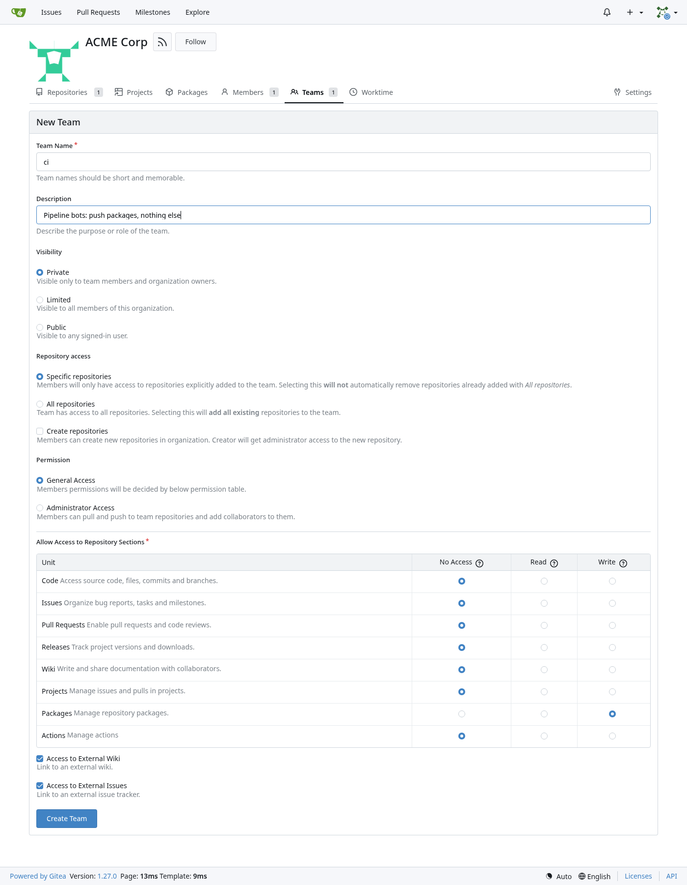

- **Visibility: Private**, so only members and org owners see it.
- **Repository access: Specific repositories,** with none added. CI doesn't need to read any repo through this team; the job token handles the checkout.
- **Permission: General Access,** then **Packages: Write** and **No Access** for everything else. That's the whole point of the team: publish packages for `acme-corp`, nothing more.
- Then add **`ci-bot`** as a member on the team page.

**Team `developers`, for people:**

- **Repository access: All repositories,** so new repos are included automatically.
- **Code, Issues, Pull Requests, Releases, Wiki, Projects and Actions: Write. Packages: Read.** Developers work on code and can pull packages, but only CI publishes them.
- Then add **`unni-p`** as a member.

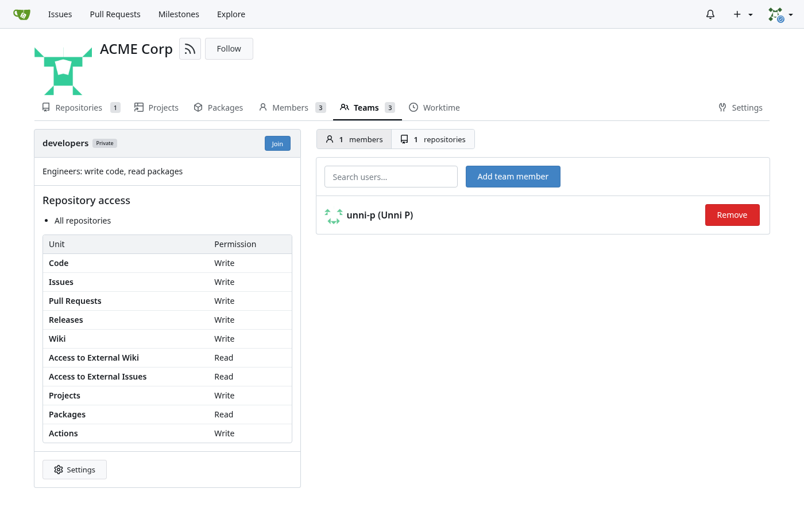

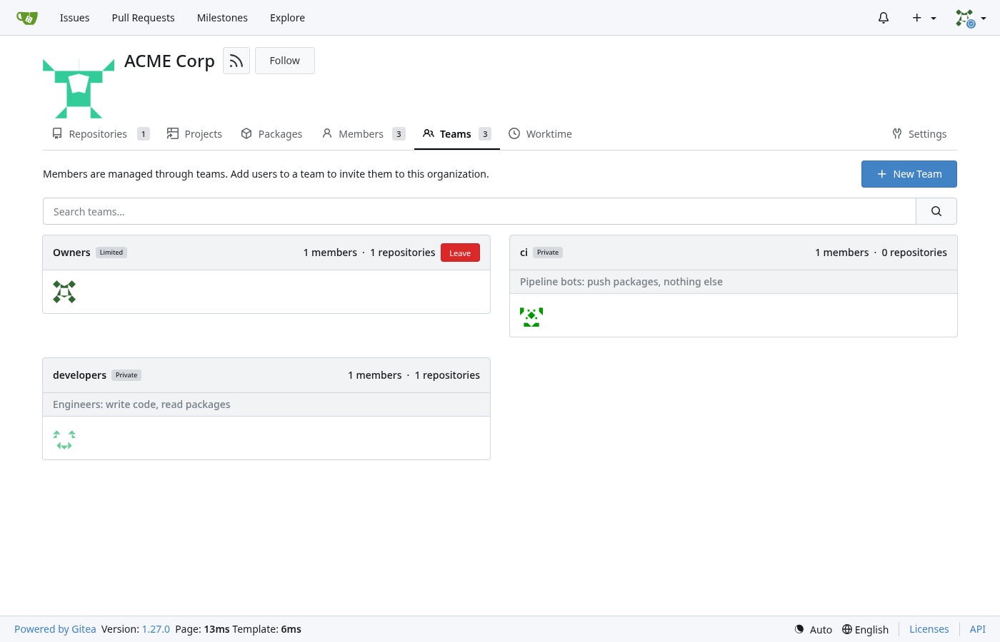

| Team | Members | Repos | Code | Packages | Why |
|---|---|---|---|---|---|
| Owners | `gitea_admin` | All | Admin | Admin | Created with the org; manages everything |
| `developers` | `unni-p` | All | Write | Read | Day-to-day work; can't publish releases by hand |
| `ci` | `ci-bot` | None | None | Write | Publishes packages, can't touch code |

---

## Step 14: Org-level CI settings: variables and a secret

CI needs to know where the registry is and how to log in. First, a token for `ci-bot`:

```console
$ CI_TOKEN=$(kubectl --namespace gitea exec deploy/gitea --container gitea -- \
  gitea admin user generate-access-token \
  --username ci-bot --token-name ci-registry --scopes write:package --raw)
```

- `gitea admin user generate-access-token` creates a token for any user from inside the pod. It's the only way to get one for a bot, since bots can't log in.
- `--token-name ci-registry` is the label you'll see later when you need to revoke it.
- `--scopes write:package` allows pushing and pulling packages, and nothing else. `--raw` prints only the token, so `CI_TOKEN` catches it cleanly.

Now store it, plus two variables, **at the org level**. tea 0.16 only handles repo-level secrets, so this is in the UI under **acme-corp → Settings → Actions**. In **Variables**, add:

- `REGISTRY` = your Gitea host without `https://`, like `git.example.com`.
- `REGISTRY_USER` = `ci-bot`.

In **Secrets**, add `REGISTRY_TOKEN` with the value of `$CI_TOKEN` (`echo "$CI_TOKEN"` to copy it once).

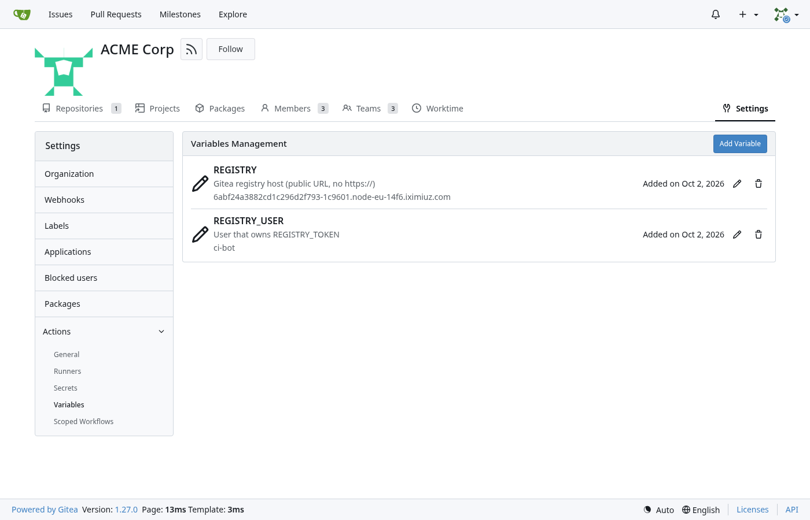

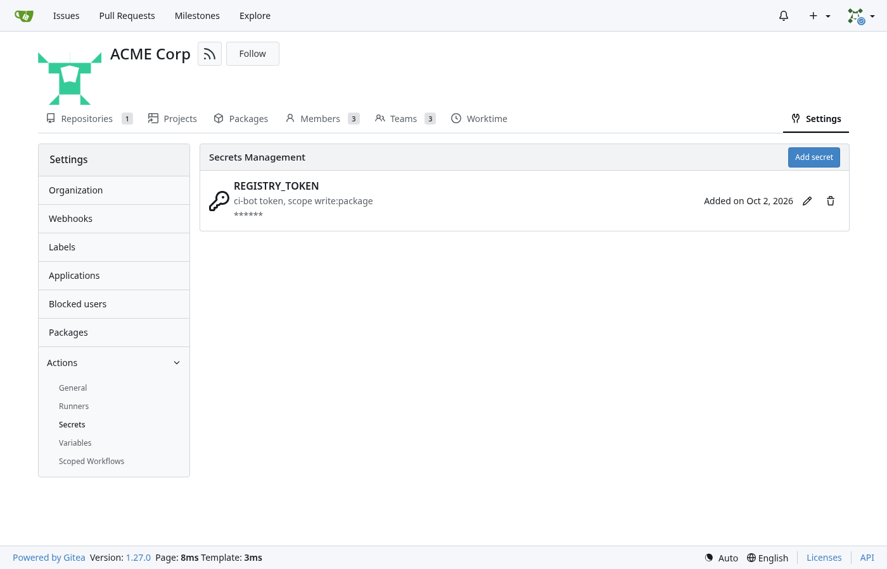

**Org level or repo level?**

| | Org level | Repo level |
|---|---|---|
| Where | Org → Settings → Actions | Repo → Settings → Actions |
| Who gets it | Every repo in the org | One repo |
| With tea 0.16 | UI only | `tea actions secrets create`, `tea actions variables set` |
| Same name in both | Repo value wins | Repo value wins |
| Good for | Registry host, CI bot token, shared endpoints | App-specific settings, a deploy key for one app |

Best practice: put shared things like the registry login **once at the org level**. Every new repo picks them up, and rotating the token is a single change.

---

## Step 15: A first workflow

Clone the repo and set your Git identity if you haven't yet:

```console
$ git config --global user.name "Unni P"
$ git config --global user.email "unni-p@acme-corp.local"
$ git clone https://git.example.com/acme-corp/backend-api.git
Cloning into 'backend-api'...
$ cd backend-api
$ mkdir --parents .gitea/workflows
```

- `git config --global` sets the name and email Git puts on every commit.
- `git clone` gets the private repo without a password prompt, thanks to tea's credential helper.
- `mkdir --parents` creates `.gitea/workflows` in one go. That's where Gitea looks for workflows.

Create `.gitea/workflows/hello.yaml`:

```yaml
name: hello
on: [push]

jobs:
  hello:
    runs-on: ubuntu-latest
    steps:
      - uses: actions/checkout@v4
      - run: |
          echo "Hello from Gitea Actions"
          uname -a
          docker version
```

- `name: hello` is how it shows up in the Actions tab. `on: [push]` runs it on every push.
- `jobs.hello` is one job, and `runs-on: ubuntu-latest` sends it to our runner.
- `uses: actions/checkout@v4` checks out the repo. `run: |` is a shell script, and `docker version` proves the job reaches the dind daemon.

```console
$ git add .gitea/workflows/hello.yaml
$ git commit --message "Add hello workflow"
[main 894e463] Add hello workflow
 1 file changed, 12 insertions(+)
 create mode 100644 .gitea/workflows/hello.yaml
$ git push
To https://git.example.com/acme-corp/backend-api.git
   e4587b7..894e463  main -> main
```

- `git add` stages the file, `git commit --message` records it, and `git push` sends it to Gitea. The push is what triggers the workflow.

```console
$ tea actions runs list
┌────┬───────────┬────────────────────┬────────┬───────┬──────────────────┬──────────┐
│ ID │  STATUS   │      WORKFLOW      │ BRANCH │ EVENT │     STARTED      │ DURATION │
├────┼───────────┼────────────────────┼────────┼───────┼──────────────────┼──────────┤
│ 1  │ completed │ Add hello workflow │ main   │ push  │ 2026-10-02 03:32 │ 37s      │
└────┴───────────┴────────────────────┴────────┴───────┴──────────────────┴──────────┘

$ tea actions runs view 1
Run ID: 1
Status: completed
Conclusion: success
Path: hello.yaml@refs/heads/main
Triggered by: gitea_admin

$ tea actions runs logs 1
...
Hello from Gitea Actions
Linux 2f1f572b3af7 6.1.167 #1 SMP PREEMPT_DYNAMIC Thu Apr 16 10:07:08 UTC 2026 x86_64 x86_64 x86_64 GNU/Linux
...
Server: Docker Engine - Community
 Engine:
  Version:          29.5.2
...
Job succeeded
```

- `tea actions runs list` lists the runs of the repo you're in. The `WORKFLOW` column actually shows the commit message.
- `tea actions runs view 1` shows one run, and `Conclusion: success` is the green tick. `tea actions runs logs 1` prints the job output.
- The Docker `Server` version, 29.5.2, is the dind sidecar. The first run took 37 seconds, mostly to pull the 1 GB job image; later runs start in seconds.

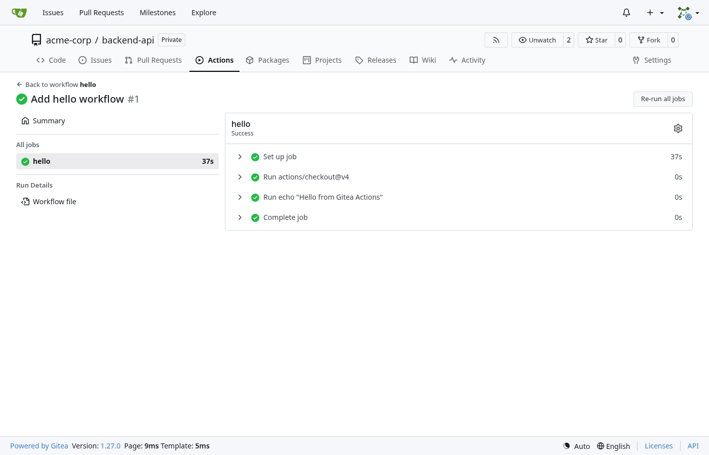

---

## Writing a pipeline: the workflow file, key by key

Before the real pipeline, here's what you can put in a workflow file. Gitea follows the GitHub Actions syntax.

| Key | What it does |
|---|---|
| `name` | The workflow's display name. |
| `on` | The events that start it: `push`, `pull_request`, `workflow_dispatch` (a "Run workflow" button), `schedule` (cron). |
| `on.push.branches` / `on.push.tags` | Only react to these branches or tags, with wildcards like `"v*"`. |
| `on.push.paths` | Only run when files under these paths change. |
| `env` | Environment variables for all jobs (or one job, or one step, wherever you put it). |
| `concurrency` | Groups runs; with `cancel-in-progress: true` a new run cancels the older one in the same group. |
| `jobs.<id>` | One job. The id is how other jobs refer to it. |
| `runs-on` | Which runner label the job needs. |
| `needs` | Jobs that must succeed first. Without it, jobs run in parallel. |
| `if` | A condition; the job or step is skipped when it's false. |
| `outputs` | Values a job hands to later jobs. |
| `steps` | The list of steps. |
| `uses` / `with` | Run a reusable action, with its inputs. |
| `run` | Run a shell script. |
| `id` | Names a step so later steps can read its outputs. |

And the values you can read inside `${{ }}`:

| Expression | Example value | What it is |
|---|---|---|
| `github.ref` | `refs/tags/v0.1.0` | The full Git ref that triggered the run. |
| `github.ref_name` | `v0.1.0` | The short branch or tag name. |
| `github.sha` | `894e463...` | The commit being built. |
| `github.repository` | `acme-corp/backend-api` | Owner and repo. |
| `github.repository_owner` | `acme-corp` | Just the owner. |
| `vars.REGISTRY` | `git.example.com` | A variable (repo or org level). |
| `secrets.REGISTRY_TOKEN` | `***` | A secret; masked in logs. |
| `env.IMAGE` | `git.example.com/acme-corp/backend-api` | An environment variable from `env`. |
| `steps.<id>.outputs.<name>` | `0.1.0` | An output written by an earlier step. |
| `needs.<job>.outputs.<name>` | `0.1.0` | An output of a job this one needs. |

A few Gitea specifics:

- Workflows live in `.gitea/workflows/`. If that folder doesn't exist, Gitea reads `.github/workflows/` instead, which helps when you migrate.
- `uses:` actions come from the place `DEFAULT_ACTIONS_URL` points at (GitHub for us). You can also give a full URL to an action hosted in your own Gitea.
- `runs-on` labels are whatever your runners offer. There are no hosted runners, so `ubuntu-latest` means "our runner with that label".
- The `github.*` names stay the same, so most GitHub workflows run unchanged.

---

## Step 16: The backend-api service

Now the real app. It's a tiny FastAPI service, laid out as a proper Python package so it can be published to PyPI.

```
backend-api/
├── .gitea/workflows/ci.yaml      # the pipeline
├── .gitignore
├── Dockerfile                    # builds the image from the published package
├── pyproject.toml                # package metadata and dependencies
├── src/backend_api/
│   ├── __init__.py               # empty, marks the package
│   └── main.py                   # the FastAPI app
├── tests/test_main.py            # pytest tests
└── charts/backend-api/           # the Helm chart
    ├── Chart.yaml
    ├── values.yaml
    └── templates/
        ├── deployment.yaml
        └── service.yaml
```

**`pyproject.toml`**:

```toml
[build-system]
requires = ["hatchling"]
build-backend = "hatchling.build"

[project]
name = "backend-api"
version = "0.1.0"
description = "ACME Corp backend API"
requires-python = ">=3.12"
dependencies = [
  "fastapi==0.142.2",
  "uvicorn==0.54.0",
]

[project.optional-dependencies]
test = [
  "pytest==9.1.1",
  "httpx2==2.13.1",
]
```

- `[build-system]` tells pip and `build` to use **hatchling** to turn the source into a wheel. It finds `src/backend_api/` on its own.
- `name` and `version` are what PyPI publishes. The version here is the single source of truth, and the pipeline checks the Git tag against it.
- `dependencies` are pinned exactly, so every build gets the same FastAPI and Uvicorn. `requires-python` refuses old Pythons.
- `test` is an **extra**: tools only the tests need. `pip install ".[test]"` adds pytest and httpx2, which FastAPI's test client uses to call the app.

**`src/backend_api/main.py`**:

```python
import socket
from importlib.metadata import version

from fastapi import FastAPI

APP_VERSION = version("backend-api")

app = FastAPI(title="backend-api", version=APP_VERSION)


@app.get("/api/greeting")
def greeting(name: str = "world") -> dict:
    return {"message": f"Hello, {name}! Greetings from ACME Corp."}


@app.get("/api/version")
def app_version() -> dict:
    return {"version": APP_VERSION, "hostname": socket.gethostname()}


@app.get("/healthz")
def healthz() -> dict:
    return {"status": "ok"}
```

- `version("backend-api")` reads the installed package's version, so the app always reports the version from `pyproject.toml`.
- `/api/greeting` returns a message, with an optional `?name=`. `/api/version` returns the version and the pod's hostname, which is handy after an upgrade.
- `/healthz` is what Kubernetes probes to know the pod is ready.

**`tests/test_main.py`**:

```python
from fastapi.testclient import TestClient

from backend_api.main import app

client = TestClient(app)


def test_greeting_default():
    response = client.get("/api/greeting")
    assert response.status_code == 200
    assert response.json() == {"message": "Hello, world! Greetings from ACME Corp."}


def test_greeting_with_name():
    response = client.get("/api/greeting", params={"name": "Unni"})
    assert response.json()["message"].startswith("Hello, Unni!")


def test_healthz():
    assert client.get("/healthz").json() == {"status": "ok"}
```

- `TestClient` calls the app in memory, without starting a server. Each `test_` function is one pytest test.

**`Dockerfile`**:

```dockerfile
FROM python:3.13-slim

ARG VERSION
ARG PYPI_INDEX

ENV PYTHONDONTWRITEBYTECODE=1 \
    PYTHONUNBUFFERED=1 \
    PIP_NO_CACHE_DIR=1 \
    PIP_DISABLE_PIP_VERSION_CHECK=1

RUN pip install --no-deps --index-url "${PYPI_INDEX}" "backend-api==${VERSION}" \
 && pip install "backend-api==${VERSION}"

RUN useradd --system --uid 10001 --no-create-home app
USER 10001

EXPOSE 8000

CMD ["uvicorn", "backend_api.main:app", "--host", "0.0.0.0", "--port", "8000"]
```

- The image doesn't copy the source. It **installs the exact package version CI just published to Gitea**, so the image and the PyPI package can't drift apart.
- `ARG VERSION` and `ARG PYPI_INDEX` are build arguments; CI passes the version and Gitea's PyPI URL.
- The `ENV` lines skip `.pyc` files, flush logs right away, and turn off pip's cache and update check to keep the image small and quiet.
- The first `pip install --no-deps --index-url ...` gets **only our package, only from Gitea**. The second `pip install` then finds it already installed and fetches just its dependencies from public PyPI.
- Why two steps? Gitea's install hint uses `--extra-index-url`, which makes pip look at both indexes for every name. Someone could publish a public `backend-api` with a higher version and pip might take theirs. This is called **dependency confusion**, and two separate installs avoid it.
- `useradd` and `USER 10001` run the app as a non-root user. `CMD` starts Uvicorn on port 8000.

**`.gitignore`**:

```
__pycache__/
*.egg-info/
.venv/
dist/
*.tgz
```

- Keeps Python caches, build output (`dist/`) and packaged charts (`*.tgz`) out of Git.

**The Helm chart.** `charts/backend-api/Chart.yaml`:

```yaml
apiVersion: v2
name: backend-api
description: ACME Corp backend API
type: application
version: 0.1.0
appVersion: "0.1.0"
```

- `apiVersion: v2` is the chart format for Helm 3 and newer. `name` is the chart's name and `type: application` means it deploys something.
- `version` is the chart's version and `appVersion` is the app version it deploys. CI overwrites both from the Git tag, so the files never need editing for a release.

`charts/backend-api/values.yaml`:

```yaml
replicaCount: 1

image:
  repository: registry.example.com/acme-corp/backend-api
  tag: ""
  pullPolicy: IfNotPresent

containerPort: 8000

service:
  type: ClusterIP
  port: 80

env: []

resources:
  requests:
    cpu: 50m
    memory: 64Mi
  limits:
    memory: 256Mi
```

- These are defaults with **nothing environment-specific**. The real registry host is passed at install time with `--set image.repository=...`.
- `image.tag: ""` means "use the chart's `appVersion`", so chart 0.1.0 runs image 0.1.0 automatically.
- `service.type: ClusterIP` with `port: 80` makes the app reachable inside the cluster at `http://backend-api`. `env` is an empty list of extra environment variables.

`charts/backend-api/templates/deployment.yaml`:

```yaml
apiVersion: apps/v1
kind: Deployment
metadata:
  name: {{ .Chart.Name }}
  labels:
    app.kubernetes.io/name: {{ .Chart.Name }}
    app.kubernetes.io/version: {{ .Values.image.tag | default .Chart.AppVersion | quote }}
spec:
  replicas: {{ .Values.replicaCount }}
  selector:
    matchLabels:
      app.kubernetes.io/name: {{ .Chart.Name }}
  template:
    metadata:
      labels:
        app.kubernetes.io/name: {{ .Chart.Name }}
    spec:
      securityContext:
        runAsNonRoot: true
        seccompProfile:
          type: RuntimeDefault
      containers:
        - name: {{ .Chart.Name }}
          image: "{{ .Values.image.repository }}:{{ .Values.image.tag | default .Chart.AppVersion }}"
          imagePullPolicy: {{ .Values.image.pullPolicy }}
          ports:
            - name: http
              containerPort: {{ .Values.containerPort }}
          {{- with .Values.env }}
          env:
            {{- toYaml . | nindent 12 }}
          {{- end }}
          readinessProbe:
            httpGet:
              path: /healthz
              port: http
          securityContext:
            allowPrivilegeEscalation: false
            capabilities:
              drop: ["ALL"]
          resources:
            {{- toYaml .Values.resources | nindent 12 }}
```

- `{{ .Chart.Name }}` names the Deployment `backend-api`, the same as the app. The `app.kubernetes.io/name` label ties the Deployment, its pods and the Service together.
- `image: "repository:tag"` uses the tag if set, otherwise `appVersion`. `{{- with .Values.env }}` only adds `env:` when the list isn't empty, and `toYaml ... | nindent 12` pastes it in with the right indent.
- `readinessProbe` sends traffic to the pod only after `/healthz` answers.
- `runAsNonRoot`, `seccompProfile: RuntimeDefault`, `allowPrivilegeEscalation: false` and dropping all capabilities are the standard hardening settings. They work because the image already runs as user 10001.

`charts/backend-api/templates/service.yaml`:

```yaml
apiVersion: v1
kind: Service
metadata:
  name: {{ .Chart.Name }}
  labels:
    app.kubernetes.io/name: {{ .Chart.Name }}
spec:
  type: {{ .Values.service.type }}
  selector:
    app.kubernetes.io/name: {{ .Chart.Name }}
  ports:
    - name: http
      port: {{ .Values.service.port }}
      targetPort: http
```

- The Service selects pods by the same label and forwards port 80 to the container port named `http` (8000).

---

## Step 17: The CI pipeline

`.gitea/workflows/ci.yaml`:

```yaml
name: ci

on:
  push:
    branches: [main]
    tags: ["v*"]
  pull_request:
    branches: [main]
  workflow_dispatch:

concurrency:
  group: ${{ github.workflow }}-${{ github.ref }}
  cancel-in-progress: true

env:
  PYPI_URL: https://${{ vars.REGISTRY }}/api/packages/${{ github.repository_owner }}/pypi
  IMAGE: ${{ vars.REGISTRY }}/${{ github.repository_owner }}/backend-api
  CHARTS: oci://${{ vars.REGISTRY }}/${{ github.repository_owner }}/charts

jobs:
  test:
    runs-on: ubuntu-latest
    steps:
      - uses: actions/checkout@v4

      - uses: actions/setup-python@v5
        with:
          python-version: "3.13"

      - name: Install the app and test tools
        run: pip install --editable ".[test]"

      - name: Run the tests
        run: pytest --verbose

  package:
    needs: test
    if: startsWith(github.ref, 'refs/tags/v')
    runs-on: ubuntu-latest
    outputs:
      version: ${{ steps.version.outputs.version }}
    steps:
      - uses: actions/checkout@v4

      - uses: actions/setup-python@v5
        with:
          python-version: "3.13"

      - name: Check the tag matches pyproject.toml
        id: version
        run: |
          VERSION="${GITHUB_REF_NAME#v}"
          grep --quiet "^version = \"${VERSION}\"$" pyproject.toml
          echo "version=${VERSION}" >> "$GITHUB_OUTPUT"

      - name: Build the wheel
        run: |
          pip install build twine
          python -m build

      - name: Upload to the Gitea PyPI registry
        env:
          TWINE_REPOSITORY_URL: ${{ env.PYPI_URL }}
          TWINE_USERNAME: ${{ vars.REGISTRY_USER }}
          TWINE_PASSWORD: ${{ secrets.REGISTRY_TOKEN }}
        run: twine upload dist/*

  image:
    needs: package
    runs-on: ubuntu-latest
    env:
      VERSION: ${{ needs.package.outputs.version }}
    steps:
      - uses: actions/checkout@v4

      - name: Log in to the Gitea container registry
        run: echo "${{ secrets.REGISTRY_TOKEN }}" | docker login "${{ vars.REGISTRY }}" --username "${{ vars.REGISTRY_USER }}" --password-stdin

      - name: Build the image from the published wheel
        run: |
          docker image build \
            --build-arg VERSION="$VERSION" \
            --build-arg PYPI_INDEX="$PYPI_URL/simple/" \
            --tag "$IMAGE:$VERSION" .

      - name: Push the image
        run: docker image push "$IMAGE:$VERSION"

  chart:
    needs: [package, image]
    runs-on: ubuntu-latest
    env:
      VERSION: ${{ needs.package.outputs.version }}
    steps:
      - uses: actions/checkout@v4

      - uses: azure/setup-helm@v4
        with:
          version: v4.3.0

      - name: Log in to the Gitea OCI registry
        run: echo "${{ secrets.REGISTRY_TOKEN }}" | helm registry login "${{ vars.REGISTRY }}" --username "${{ vars.REGISTRY_USER }}" --password-stdin

      - name: Package and push the chart
        run: |
          helm package charts/backend-api --version "$VERSION" --app-version "$VERSION"
          helm push "backend-api-$VERSION.tgz" "$CHARTS"
```

Here's the shape of it:

```
 push to main / pull request          push of a tag v1.2.3
 ---------------------------          ------------------------------------------------------
 [test]                               [test] -> [package] -> [image] -> [chart]
  pip install, pytest                          wheel to     image from   chart to
                                               PyPI         that wheel   OCI registry
```

### Triggers and shared settings

- `on.push.branches: [main]` tests every push to `main`, and `on.push.tags: ["v*"]` also runs on tags like `v0.1.0`. That tag is our "release" signal.
- `on.pull_request.branches: [main]` tests pull requests aimed at `main`, and `workflow_dispatch` adds a **Run workflow** button in the UI.
- `concurrency` groups runs by workflow and ref. If you push twice quickly to the same branch, the older run is cancelled.
- `env` builds three addresses from the org variable and the repo owner: the PyPI upload URL, the image name `git.example.com/acme-corp/backend-api`, and the chart location `oci://git.example.com/acme-corp/charts`.

### Job `test`

- Runs on every trigger. `actions/setup-python@v5` installs Python 3.13 into the job container.
- `pip install --editable ".[test]"` installs the app from the checked-out source plus the test extra. `--editable` links the source instead of copying it.
- `pytest --verbose` runs the tests and lists each one. If a test fails, the job fails and nothing else runs.

### Job `package`

- `needs: test` waits for the tests, and `if: startsWith(github.ref, 'refs/tags/v')` skips this job (and everything after it) unless the run is for a `v` tag.
- `outputs.version` hands the version to later jobs, taken from the step with `id: version`.
- `VERSION="${GITHUB_REF_NAME#v}"` turns `v0.1.0` into `0.1.0`. `grep --quiet` fails the job if `pyproject.toml` has a different version, so a wrong tag can't publish anything.
- `echo "version=..." >> "$GITHUB_OUTPUT"` is how a step sets an output.
- `python -m build` creates the wheel and the source archive in `dist/`. `twine upload dist/*` uploads them to Gitea's PyPI registry, logging in as `ci-bot` with the org secret through the `TWINE_*` variables.

### Job `image`

- `needs: package` waits for the upload, and `needs.package.outputs.version` brings the version over.
- `docker login ... --password-stdin` reads the token from a pipe, so it never shows up in the process list. The user must be the token's owner, `ci-bot`.
- `docker image build --build-arg ...` passes the version and the PyPI index to the Dockerfile, and `--tag` names it `git.example.com/acme-corp/backend-api:0.1.0`.
- `docker image push` uploads it to Gitea's container registry.

### Job `chart`

- `needs: [package, image]` makes sure the image exists before a chart that points at it is published.
- `azure/setup-helm@v4` downloads Helm v4.3.0 into the job. This is the download that hung before the MTU fix in Step 9.
- `helm registry login` logs Helm in to the same registry. `helm package --version --app-version` sets both versions from the tag and writes `backend-api-0.1.0.tgz`.
- `helm push ... oci://git.example.com/acme-corp/charts` uploads the chart. It lands at `acme-corp/charts/backend-api`.
- **Why the `charts/` part?** In an OCI registry, a chart and an image are both stored by name. Pushing the chart to `oci://.../acme-corp` would make it `acme-corp/backend-api:0.1.0`, the exact same name and tag as the image, so one would overwrite the other.

---

## Step 18: Push the app

Replace the hello workflow with the real files from Steps 16 and 17, then commit:

```console
$ git rm --quiet .gitea/workflows/hello.yaml
$ git status --short
D  .gitea/workflows/hello.yaml
?? .gitea/
?? .gitignore
?? Dockerfile
?? charts/
?? pyproject.toml
?? src/
?? tests/

$ git add .
$ git commit --message "Add backend-api app, tests, Helm chart and CI pipeline"
[main b8e18d5] Add backend-api app, tests, Helm chart and CI pipeline
 12 files changed, 276 insertions(+), 12 deletions(-)
$ git push
To https://git.example.com/acme-corp/backend-api.git
   894e463..b8e18d5  main -> main
```

- `git rm --quiet` deletes the hello workflow and stages the deletion. It did its job.
- `git status --short` shows what changed: `D` is deleted and `??` is new. `git add .` stages everything in the folder.

This push is to `main`, not a tag, so only the tests should run:

```console
$ tea actions runs view 2
Conclusion: success
Path: ci.yaml@refs/heads/main

Jobs:
┌────┬─────────┬───────────┬───────────────────────┬──────────────────┬──────────┐
│ ID │  NAME   │  STATUS   │        RUNNER         │     STARTED      │ DURATION │
├────┼─────────┼───────────┼───────────────────────┼──────────────────┼──────────┤
│ 5  │ chart   │ completed │ -                     │ 1970-01-01 00:00 │ 0s       │
│ 4  │ image   │ completed │ -                     │ 1970-01-01 00:00 │ 0s       │
│ 3  │ package │ completed │ -                     │ 1970-01-01 00:00 │ 0s       │
│ 2  │ test    │ completed │ gitea-runner-runner-0 │ 2026-10-02 03:33 │ 14s      │
└────┴─────────┴───────────┴───────────────────────┴──────────────────┴──────────┘
```

- Only `test` ran on the runner. The other three have no runner and no start time, because their `if` was false and they were skipped. The UI shows it more clearly:

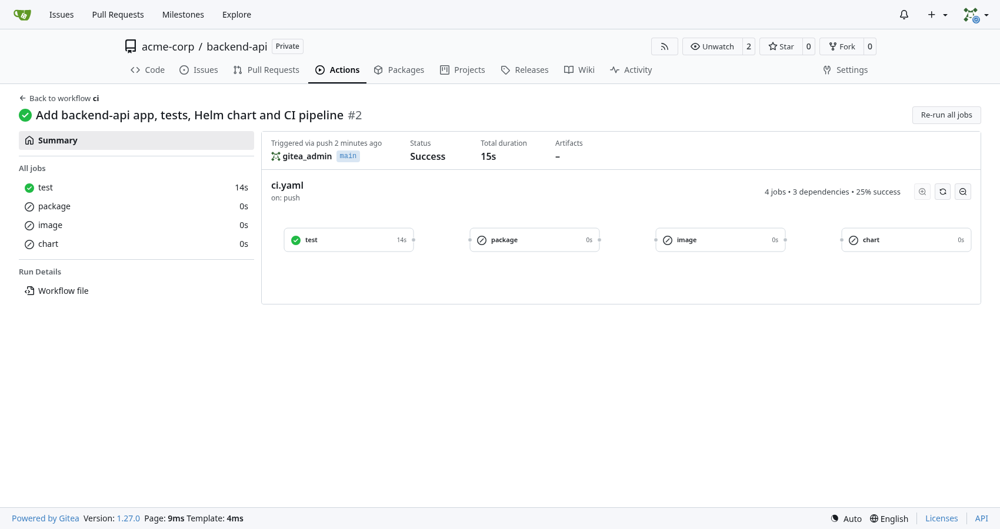

---

## Step 19: Release 0.1.0 with a tag

```console
$ git tag --annotate v0.1.0 --message "backend-api 0.1.0"
$ git push origin v0.1.0
To https://git.example.com/acme-corp/backend-api.git
 * [new tag]         v0.1.0 -> v0.1.0
```

- `git tag --annotate v0.1.0 --message ...` creates an annotated tag, which stores who tagged it, when and why. `git push origin v0.1.0` sends just that tag.

```console
$ tea actions runs view 3
Conclusion: success
Path: ci.yaml@refs/tags/v0.1.0

Jobs:
┌────┬─────────┬───────────┬───────────────────────┬──────────────────┬──────────┐
│ ID │  NAME   │  STATUS   │        RUNNER         │     STARTED      │ DURATION │
├────┼─────────┼───────────┼───────────────────────┼──────────────────┼──────────┤
│ 9  │ chart   │ completed │ gitea-runner-runner-0 │ 2026-10-02 03:34 │ 5s       │
│ 8  │ image   │ completed │ gitea-runner-runner-0 │ 2026-10-02 03:34 │ 10s      │
│ 7  │ package │ completed │ gitea-runner-runner-0 │ 2026-10-02 03:34 │ 6s       │
│ 6  │ test    │ completed │ gitea-runner-runner-0 │ 2026-10-02 03:33 │ 4s       │
└────┴─────────┴───────────┴───────────────────────┴──────────────────┴──────────┘
```

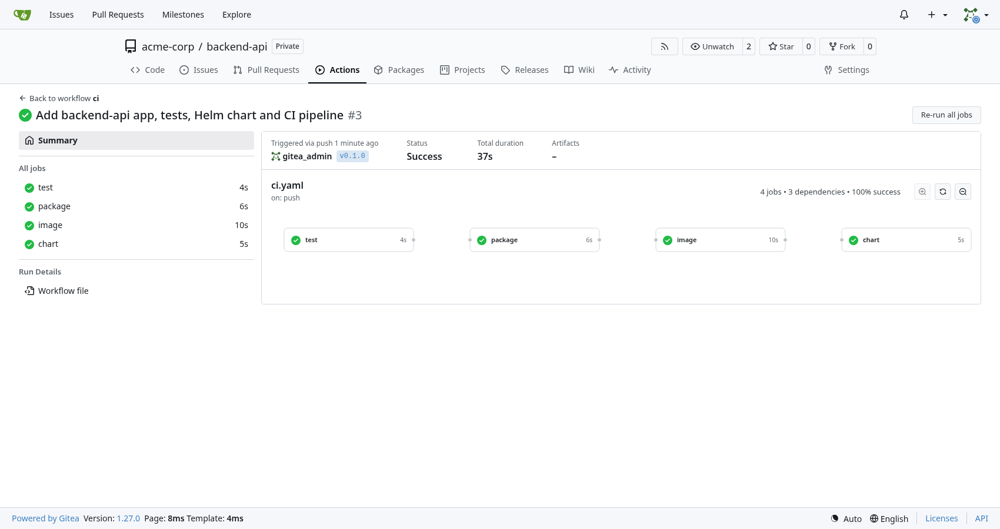

The interesting lines from `tea actions runs logs 3`, job by job:

```console
tests/test_main.py::test_greeting_default PASSED                         [ 33%]
tests/test_main.py::test_greeting_with_name PASSED                       [ 66%]
tests/test_main.py::test_healthz PASSED                                  [100%]
============================== 3 passed in 0.16s ===============================

Successfully built backend_api-0.1.0.tar.gz and backend_api-0.1.0-py3-none-any.whl
Uploading distributions to https://git.example.com/api/packages/acme-corp/pypi
Uploading backend_api-0.1.0-py3-none-any.whl
Uploading backend_api-0.1.0.tar.gz

Login Succeeded
#5 [2/3] RUN pip install --no-deps --index-url "https://git.example.com/api/packages/acme-corp/pypi/simple/" "backend-api==0.1.0"
#5 0.744 Looking in indexes: https://git.example.com/api/packages/acme-corp/pypi/simple/
#5 0.767   Downloading backend_api-0.1.0-py3-none-any.whl (1.5 kB)
#5 0.808 Successfully installed backend-api-0.1.0
#7 naming to git.example.com/acme-corp/backend-api:0.1.0 done
0.1.0: digest: sha256:96e5fdbbc5b3715e22ba3ca4df752b5425ea79bc74484eece08ea58aca8d9100 size: 856

Downloading 'v4.3.0' from 'https://get.helm.sh'
Helm tool version 'v4.3.0' has been cached at /opt/hostedtoolcache/helm/4.3.0/x64/linux-amd64/helm
Login Succeeded
Successfully packaged chart and saved it to: /workspace/acme-corp/backend-api/backend-api-0.1.0.tgz
Pushed: git.example.com/acme-corp/charts/backend-api:0.1.0
Digest: sha256:25a93ae078ed4bad8ec689466097e74ce0f1f38eac52fd65b65d6655d996479e
```

- **test:** all three tests passed.
- **package:** `build` made the wheel and source archive, and `twine` uploaded both to the org's PyPI registry.
- **image:** the Dockerfile installed `backend-api==0.1.0` from Gitea's index, which is the package uploaded seconds earlier. The image was tagged `0.1.0` and pushed.
- **chart:** setup-helm installed Helm, and the chart was packaged and pushed to `acme-corp/charts/backend-api:0.1.0`.

---

## How Gitea packages work

Now that there's something in the registry, this is the part worth understanding.

- **Packages belong to an owner, not a repo.** Ours belong to `acme-corp`, so their addresses all start with the org: `acme-corp/pypi`, `acme-corp/backend-api`, `acme-corp/charts/backend-api`.
- **Visibility comes from the owner.** `acme-corp` is public, so anyone can download its packages, even though the repo is private. Make the org private and every pull needs a token.
- **Publishing needs package write access on the owner.** A token's scopes only limit what the token may do; the permission itself comes from the user's role in the org. That's why `ci-bot` is in the `ci` team with Packages: Write.
- **Linking to a repo is optional** and only affects where the package shows up. It doesn't change permissions or visibility.

| Approach | Where packages live | Good | Not so good |
|---|---|---|---|
| **Org-owned, linked to the repo** (what we do) | `acme-corp/...` | Shared by the team, survives people leaving, visible on the repo's Packages tab | One link to set per package |
| Org-owned, not linked | `acme-corp/...` | Shared by the team | Only visible on the org's Packages tab |
| User-owned | `unni-p/...` | Quick for experiments | Breaks when the user leaves; access is per person |

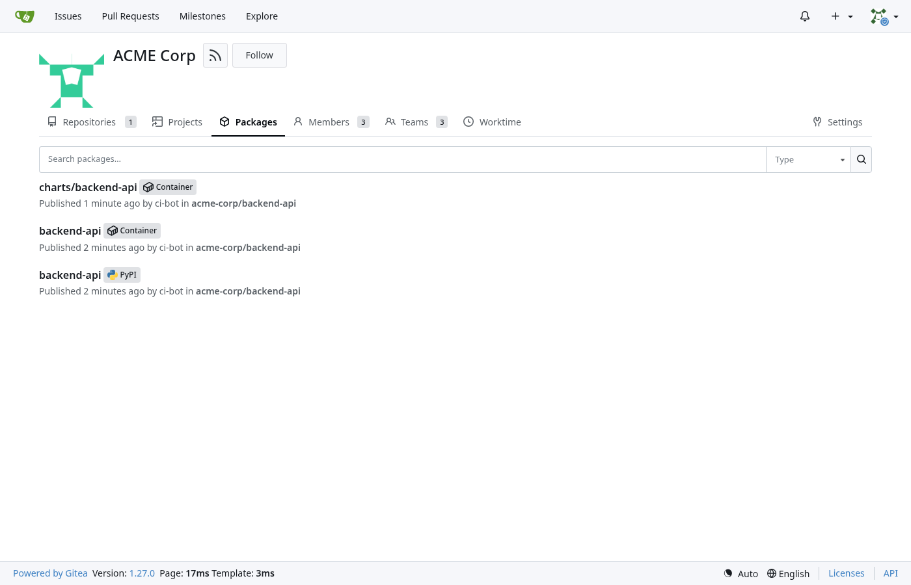

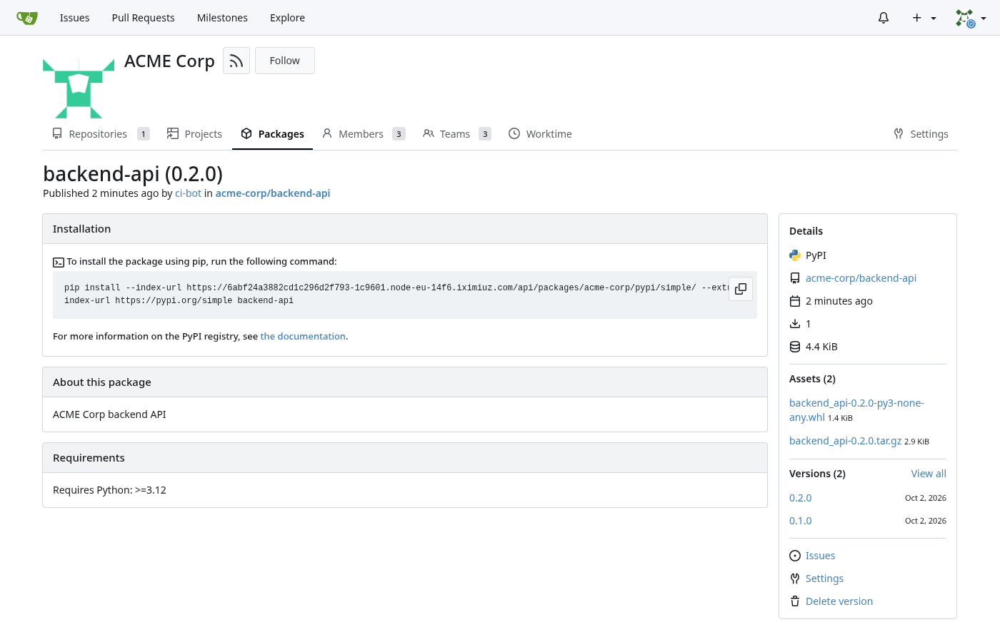

The same registry handles many other package types. We only used three:

| Type | Client | Address pattern |
|---|---|---|
| PyPI | `pip`, `twine` | `https://<host>/api/packages/<owner>/pypi` |
| Container | `docker`, `podman` | `<host>/<owner>/<image>:<tag>` |
| Helm (OCI) | `helm push` / `helm install oci://...` | `oci://<host>/<owner>/<path>` |
| Helm (classic repo) | `helm repo add`, `helm cm-push` | `https://<host>/api/packages/<owner>/helm` |
| npm | `npm` | `https://<host>/api/packages/<owner>/npm/` |
| Maven | `mvn`, Gradle | `https://<host>/api/packages/<owner>/maven` |
| Go | `go` | `https://<host>/api/packages/<owner>/go` |
| Generic | `curl` | `https://<host>/api/packages/<owner>/generic/<name>/<version>/<file>` |

---

## Step 20: Use the packages

Let's install everything from Gitea, as a user of these packages would. First a namespace:

```console
$ kubectl create namespace demo
namespace/demo created
```

**pip:** list the versions in the org's PyPI registry, from a throwaway Python pod:

```console
$ kubectl --namespace demo run pip-test --image=python:3.13-slim \
  --rm --attach --restart=Never --quiet -- \
  pip index versions backend-api \
  --index-url https://git.example.com/api/packages/acme-corp/pypi/simple/
backend-api (0.1.0)
Available versions: 0.1.0
```

- `kubectl run pip-test --image=python:3.13-slim` starts a one-off pod. `--rm` deletes it afterwards, `--attach` shows its output, `--restart=Never` runs it once and `--quiet` hides kubectl's own messages.
- Everything after `--` is the command in the container. `pip index versions backend-api --index-url .../simple/` asks Gitea's PyPI index which versions exist; `/simple/` is the standard index path pip reads.

**Helm:** look at the chart, then install it:

```console
$ helm show chart oci://git.example.com/acme-corp/charts/backend-api --version 0.1.0
Pulled: git.example.com/acme-corp/charts/backend-api:0.1.0
Digest: sha256:25a93ae078ed4bad8ec689466097e74ce0f1f38eac52fd65b65d6655d996479e
apiVersion: v2
appVersion: 0.1.0
description: ACME Corp backend API
name: backend-api
type: application
version: 0.1.0

$ helm upgrade --install backend-api \
  oci://git.example.com/acme-corp/charts/backend-api --version 0.1.0 \
  --namespace demo \
  --set image.repository=git.example.com/acme-corp/backend-api \
  --wait --timeout 5m
Release "backend-api" does not exist. Installing it now.
Pulled: git.example.com/acme-corp/charts/backend-api:0.1.0
NAME: backend-api
NAMESPACE: demo
STATUS: deployed
REVISION: 1
DESCRIPTION: Install complete
```

- `helm show chart oci://...` downloads the chart and prints its `Chart.yaml`. `appVersion: 0.1.0` came from the tag, set by CI.
- `helm upgrade --install backend-api oci://... --version 0.1.0` installs straight from Gitea, with no `helm repo add` needed for OCI.
- `--set image.repository=...` fills in the registry host, the one environment-specific value. The tag defaults to the chart's `appVersion`.
- No login was needed for the chart or the image, because the org is public.

```console
$ kubectl --namespace demo get deployment,pods,service
NAME                          READY   UP-TO-DATE   AVAILABLE   AGE
deployment.apps/backend-api   1/1     1            1           3s

NAME                               READY   STATUS    RESTARTS   AGE
pod/backend-api-6848644f45-mf6tt   1/1     Running   0          3s

NAME                  TYPE        CLUSTER-IP      EXTERNAL-IP   PORT(S)   AGE
service/backend-api   ClusterIP   10.43.113.196   <none>        80/TCP    3s

$ kubectl --namespace demo run curl --image=curlimages/curl:8.17.0 \
  --rm --attach --restart=Never --quiet -- \
  --silent "http://backend-api/api/greeting?name=Unni"
{"message":"Hello, Unni! Greetings from ACME Corp."}

$ kubectl --namespace demo run curl --image=curlimages/curl:8.17.0 \
  --rm --attach --restart=Never --quiet -- \
  --silent http://backend-api/api/version
{"version":"0.1.0","hostname":"backend-api-6848644f45-mf6tt"}
```

- The Deployment is called `backend-api`, the same as the app, and its pod is ready, which means `/healthz` answered.
- The curl pod calls the Service by its name, `backend-api`, from inside the namespace. Both endpoints answer, and the version is `0.1.0`.
- If you make the org private later, create a `docker-registry` Secret with a `read:package` token, add it to the pod as `imagePullSecrets`, and run `helm registry login` before installing the chart.

---

## Step 21: Link the packages to the repo

Right now the packages only show up on the org's Packages tab. To see them on the repo too, open each package, go to **Settings**, and under **Link this package to a repository** pick `backend-api`.

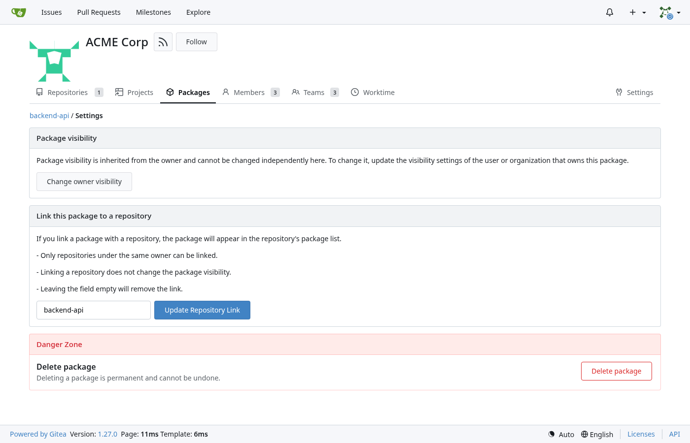

- The page confirms what we said earlier: **package visibility is inherited from the owner** and can't be set per package.
- Only repos of the same owner can be linked, and linking doesn't change who can see the package.

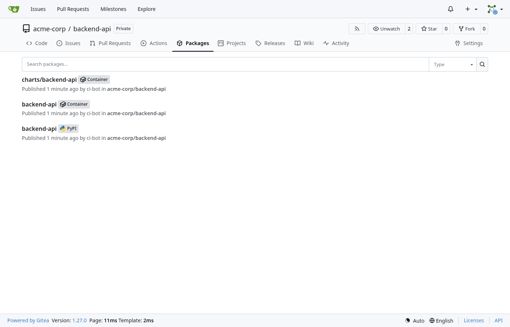

---

## Step 22: Ship 0.2.0

A release is now just a version bump and a tag:

```console
$ sed --in-place 's/^version = "0.1.0"$/version = "0.2.0"/' pyproject.toml
$ git diff
-version = "0.1.0"
+version = "0.2.0"
$ git commit --all --message "Release 0.2.0"
[main d88ed8a] Release 0.2.0
 1 file changed, 1 insertion(+), 1 deletion(-)
$ git push
$ git tag --annotate v0.2.0 --message "backend-api 0.2.0"
$ git push origin v0.2.0
 * [new tag]         v0.2.0 -> v0.2.0
```

- `sed --in-place` edits `pyproject.toml` in place, swapping the version line. `git diff` shows the one changed line.
- `git commit --all` stages and commits every tracked file that changed. The push to `main` runs the tests, and the tag runs the release.

```console
$ tea actions runs list
┌────┬───────────┬────────────────────────────────────────────────────────┬────────┬───────┬──────────────────┬──────────┐
│ ID │  STATUS   │                        WORKFLOW                        │ BRANCH │ EVENT │     STARTED      │ DURATION │
├────┼───────────┼────────────────────────────────────────────────────────┼────────┼───────┼──────────────────┼──────────┤
│ 5  │ completed │ Release 0.2.0                                          │        │ push  │ 2026-10-02 03:36 │ 26s      │
│ 4  │ completed │ Release 0.2.0                                          │ main   │ push  │ 2026-10-02 03:36 │ 5s       │
│ 3  │ completed │ Add backend-api app, tests, Helm chart and CI pipeline │        │ push  │ 2026-10-02 03:33 │ 37s      │
│ 2  │ completed │ Add backend-api app, tests, Helm chart and CI pipeline │ main   │ push  │ 2026-10-02 03:33 │ 15s      │
│ 1  │ completed │ Add hello workflow                                     │ main   │ push  │ 2026-10-02 03:32 │ 37s      │
└────┴───────────┴────────────────────────────────────────────────────────┴────────┴───────┴──────────────────┴──────────┘
```

- Tag runs have an empty `BRANCH` column, because they're for a tag. Run 5 is the 0.2.0 release, and it took 26 seconds now that the job image is cached.

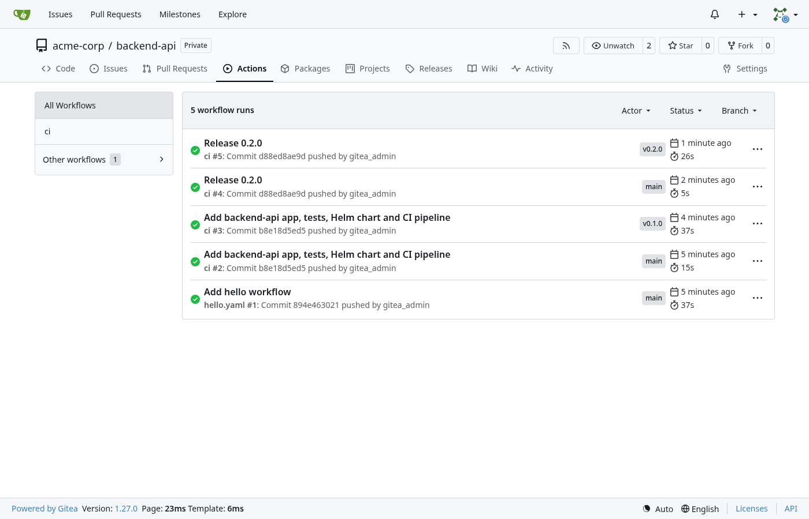

Upgrade the app to the new chart:

```console
$ helm upgrade --install backend-api \
  oci://git.example.com/acme-corp/charts/backend-api --version 0.2.0 \
  --namespace demo \
  --set image.repository=git.example.com/acme-corp/backend-api \
  --wait --timeout 5m
Pulled: git.example.com/acme-corp/charts/backend-api:0.2.0
Release "backend-api" has been upgraded. Happy Helming!
STATUS: deployed
REVISION: 2

$ helm history backend-api --namespace demo
REVISION	UPDATED                 	STATUS    	CHART            	APP VERSION	DESCRIPTION
1       	Fri Oct  2 03:35:03 2026	superseded	backend-api-0.1.0	0.1.0      	Install complete
2       	Fri Oct  2 03:37:08 2026	deployed  	backend-api-0.2.0	0.2.0      	Upgrade complete

$ kubectl --namespace demo run curl --image=curlimages/curl:8.17.0 \
  --rm --attach --restart=Never --quiet -- \
  --silent http://backend-api/api/version
{"version":"0.2.0","hostname":"backend-api-7d6896d484-56llf"}

$ kubectl --namespace demo run pip-test --image=python:3.13-slim \
  --rm --attach --restart=Never --quiet -- \
  pip index versions backend-api \
  --index-url https://git.example.com/api/packages/acme-corp/pypi/simple/
backend-api (0.2.0)
Available versions: 0.2.0, 0.1.0
```

- The same `helm upgrade --install` command, with `--version 0.2.0`, upgrades the release. `helm history` shows both revisions, and `helm rollback backend-api 1 --namespace demo` would go back.
- The app reports `0.2.0` from a new pod, and the PyPI registry now has both versions.

---

## Gotchas worth knowing

- **Headless Services can't be NodePorts.** The chart defaults to `clusterIP: None`. Set `clusterIP: ""` on both Services, or the install fails.
- **The registries want HTTPS and the right `ROOT_URL`.** Docker logs in through the `realm` in the `www-authenticate` header, which comes from `ROOT_URL`. A wrong URL means confusing login errors.
- **dind and MTU.** If downloads inside jobs hang while small ones work, compare the pod MTU with Docker's networks. The `extraArgs` in Step 9 fix it.
- **Bot users can't have passwords.** `--random-password` with `--user-type bot` fails. Create the bot without a password and give it a token.
- **Bots don't show in user lists.** `tea admin users list` leaves them out. They still show on team pages.
- **tea doesn't do everything.** Teams, collaborators and org-level secrets and variables need the web UI in tea 0.16.
- **Charts and images share names in OCI.** Push charts under a separate path like `acme-corp/charts`, or the chart and the image overwrite each other.
- **`--extra-index-url` invites dependency confusion.** Install your own packages from Gitea with `--no-deps --index-url`, and get public dependencies separately.
- **Scopes limit, they don't grant.** A `write:package` token can only do what its user is allowed to do. Give the bot the access through a team, like the `ci` team here.
- **The first job is slow.** The `runner-images:ubuntu-latest` image is over 1 GB. After the first pull it's cached in the dind daemon.

---

## Where this setup is weak

Everything works, but every piece is a single point of failure. That's fine for a lab or a small team.

- **One Gitea pod.** If it or its node goes down, Gitea is down until the pod starts elsewhere. Upgrades cause a short outage because of `Recreate`.
- **SQLite on one volume.** SQLite allows one writer, and a `ReadWriteOnce` volume attaches to one node. So no second Gitea pod.
- **Cache and queues in the pod.** They can't be shared, which also blocks a second pod.
- **One long-running runner.** Two jobs at a time, a privileged dind container, and if its node dies, CI stops. Jobs also share one Docker daemon.
- **No backups.** Everything lives on one local volume.

Making it production ready means PostgreSQL, a shared cache, shared storage, more Gitea replicas, TLS through an Ingress, backups and runners that scale per job. I'll cover that in a separate post, *Running Gitea on Kubernetes in Production*.

---

## Cleaning up

```console
$ helm uninstall backend-api --namespace demo
$ helm uninstall gitea-runner --namespace gitea-runner
$ helm uninstall gitea --namespace gitea
$ kubectl delete namespace demo gitea-runner gitea
```

- `helm uninstall` removes everything a release created, and `--namespace` says where to find it. I remove the app and runner first, then Gitea.
- `kubectl delete namespace` removes the namespaces and anything left in them, including Gitea's PVC. **That deletes every repo and package,** so back up first.

---

## Wrapping up

At this point you have:

- **Gitea** in one pod on SQLite, behind a public HTTPS URL, with SSH on NodePort 30222.
- **A runner** in Docker-in-Docker mode, with the MTU fixed so downloads don't hang.
- **An `acme-corp` org** with a human user, a bot user and teams that give each exactly what it needs.
- **Org-level CI settings,** so every new repo can publish without extra setup.
- **A pipeline** that tests every push and, on a tag, publishes a PyPI package, an image built from that package and a Helm chart.
- **The app in Kubernetes,** installed and upgraded straight from Gitea's registries.

That's a complete Git, CI and package platform on your own cluster, and hopefully every piece of it makes sense now.
