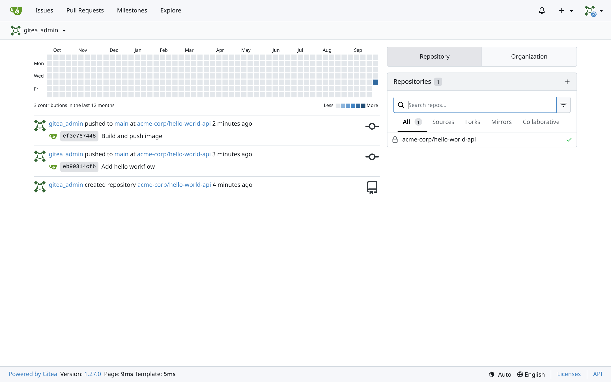
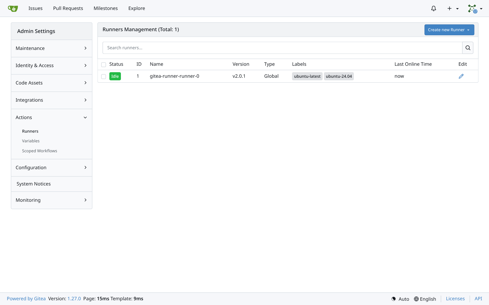
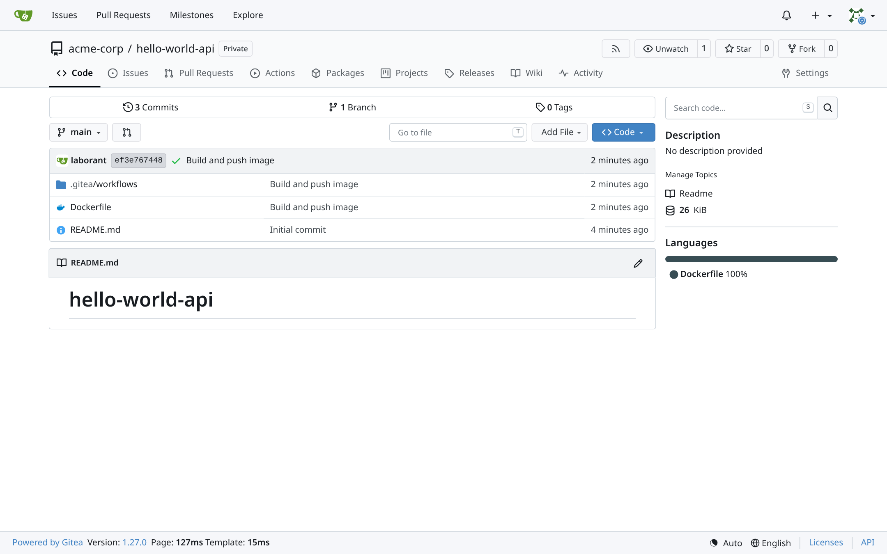
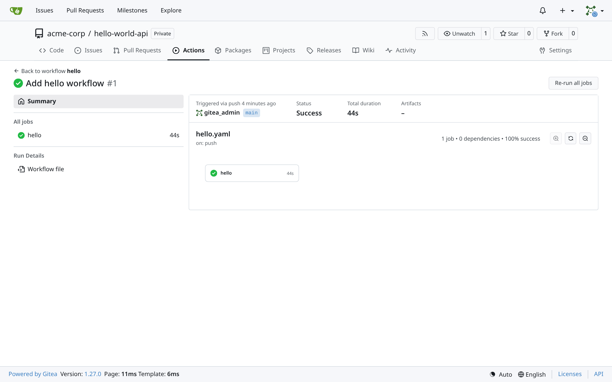
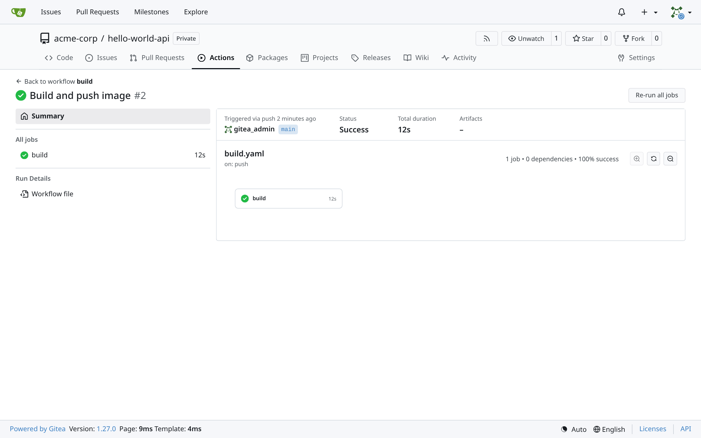
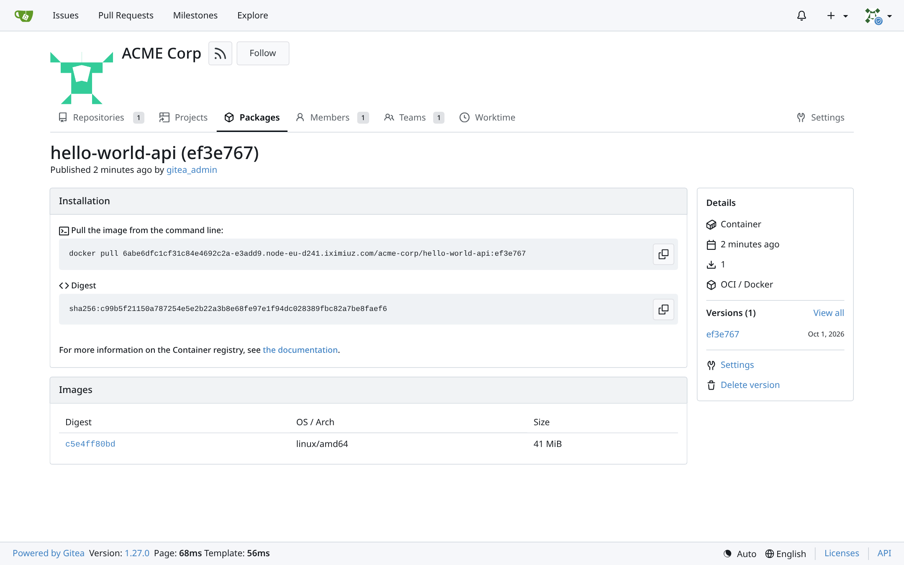
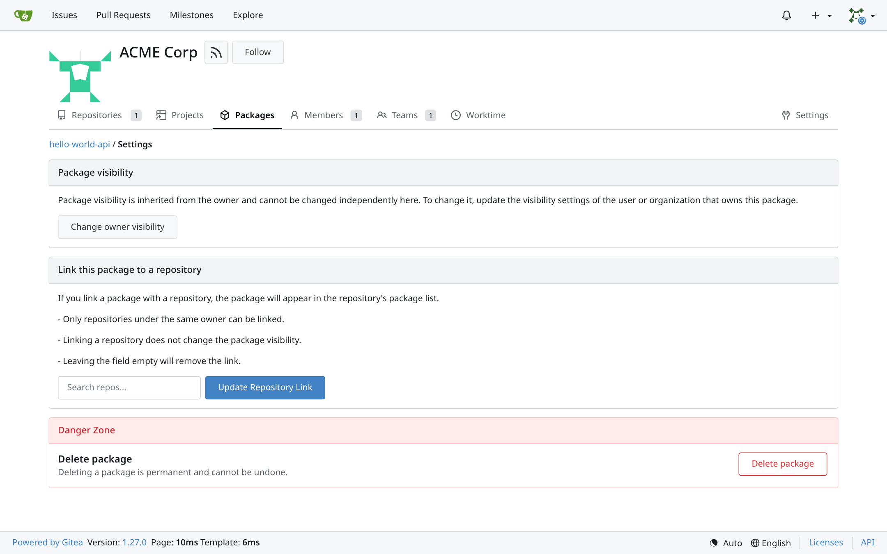

I wanted my own place for Git repos, CI pipelines and container images, running on my own cluster. GitHub and GitLab are fine, but for a homelab or a test cluster they felt like too much, and I wanted something I could fully control. Gitea turned out to be a really good fit, so I set it up on Kubernetes and took notes the whole way.

This setup keeps things simple: one Gitea pod, one runner, no high availability. It works well for a lab or a small team, and I'll point out the weak spots as we go.

I explain every command, flag and YAML line here. If you already know a part, just skip ahead.

---

## What we'll end up with

- A **Gitea** instance in Kubernetes with the web UI, Git over HTTPS and Git over SSH. Everything it stores lives on one persistent volume.
- A **container registry**, which comes built into Gitea. You can push Docker images to it and pull them straight into your cluster.
- **Gitea Actions**, Gitea's CI system. If you've written GitHub Actions workflows before, you already know the syntax.
- One **runner** inside the cluster that picks up jobs and runs them. It can build and push Docker images too.
- An **organization** called `acme-corp` with a repo in it, where CI builds an image and pushes it to the registry. That's the whole loop from code to image.

Here's how the pieces fit together:

```
                        +------------------------------------------------------+
                        |                 Kubernetes cluster                   |
                        |                                                      |
 browser / git / docker |   namespace: gitea                                   |
 ---------------------> |   +------------------------+      +--------------+   |
   https://<your-url>   |   | Pod: gitea             |----->| PVC (5Gi)    |   |
   (NodePort 30300)     |   |  - web UI + API        |      | repos, db,   |   |
                        |   |  - Git over HTTP/SSH   |      | packages     |   |
   ssh://...:30222      |   |  - container registry  |      +--------------+   |
                        |   |  - SQLite database     |                         |
                        |   +-----------^------------+                         |
                        |               | polls for jobs                       |
                        |   namespace: gitea-runner                            |
                        |   +-----------+------------------------------+       |
                        |   | Pod: gitea-runner-runner-0               |       |
                        |   |  - runner container (talks to Gitea)     |       |
                        |   |  - dind container (Docker daemon)        |       |
                        |   |      job containers run inside here      |       |
                        |   +------------------------------------------+       |
                        +------------------------------------------------------+
```

---

## A few Gitea terms first

These words come up a lot in the config, so it helps to have them straight before we start.

- **Gitea** is a self-hosted Git service written in Go. You get repos, pull requests, issues, a package registry and CI, all from one small binary.
- A **repository** (repo) is a project with its history, branches and files. In Gitea every repo belongs to a user or an organization, so you'll see paths like `acme-corp/hello-world-api`.
- An **organization** (org) is a shared owner for repos, usually a team or a company. You add people to it and control what they can do through teams.
- The **admin user** can do anything on the instance. The Helm chart creates this account for you during the install.
- **ROOT_URL** is the public address of your Gitea, like `https://git.example.com/`. Gitea builds every link, clone URL and registry login address from it, so getting it wrong breaks things in confusing ways.
- **Gitea Actions** is the built-in CI/CD. You drop workflow files into `.gitea/workflows/`, push, and Gitea takes it from there.
- A **workflow** is one of those YAML files. It says when to run, like on every push, and what to run.
- A **job** is a set of steps that runs together on one runner. If a workflow has several jobs, they can run at the same time.
- A **step** is a single command or action inside a job, like `actions/checkout@v4` or `run: docker image build .`. Steps in a job run one after another.
- A **runner** is the thing that actually executes your jobs. Gitea never runs them itself; runners keep asking Gitea for work and pick it up.
- **gitea-runner** is the official runner program. You'll also see it called `act_runner` in older docs, but it's the same project.
- A **runner label** is a name the runner advertises, like `ubuntu-latest`. A job with `runs-on: ubuntu-latest` will only go to a runner that has that label.
- A **registration token** is how a new runner proves it's allowed to join. You create it in Gitea and hand it to the runner.
- **Packages** are Gitea's built-in registries for Docker images, Helm charts, npm and more. The container registry is just one package type.
- A **personal access token** (PAT) works like a password with limited permissions. CI uses one to log in to the registry, so your real password never ends up in a pipeline.
- **Docker-in-Docker** (dind) is a Docker daemon running inside a container. The runner uses it so jobs can start containers and build images without touching the node's own container runtime.

---

## What you need before starting

- **A Kubernetes cluster.** I ran everything on [iximiuz Labs](https://labs.iximiuz.com), on a K3s playground with one control plane and three workers. You get a real multi-node cluster in the browser in a few seconds, but any cluster works, and a single node is plenty.
- **A terminal with `kubectl` and `helm`,** with Helm at 3.8 or newer. On iximiuz Labs, the playground's `cplane-01` terminal already has both, so that's where I ran everything except `labctl`.
- **A default StorageClass,** since Gitea needs a persistent volume. K3s comes with `local-path`, and `kubectl get storageclass` shows what you have.
- **An HTTPS URL that reaches Gitea.** The registry needs this, because Docker won't log in to a plain HTTP registry unless you reconfigure every Docker daemon. We'll get one from iximiuz Labs in Step 3; on your own cluster, an Ingress with a proper certificate does the same job.

Here's what my cluster looked like before I started:

```console
$ kubectl get nodes
NAME        STATUS   ROLES           AGE    VERSION
cplane-01   Ready    control-plane   6h1m   v1.36.4+k3s1
node-01     Ready    <none>          6h1m   v1.36.4+k3s1
node-02     Ready    <none>          6h1m   v1.36.4+k3s1
node-03     Ready    <none>          6h1m   v1.36.4+k3s1

$ kubectl get storageclass
NAME                   PROVISIONER             RECLAIMPOLICY   VOLUMEBINDINGMODE      ALLOWVOLUMEEXPANSION   AGE
local-path (default)   rancher.io/local-path   Delete          WaitForFirstConsumer   false                  6h1m
```

- All four nodes are `Ready`, so the cluster can schedule pods. `cplane-01` runs the Kubernetes control plane, and the three `node-*` machines are workers.
- `local-path` is marked `(default)`, so any PVC that doesn't ask for a specific StorageClass gets a volume from it. That's exactly what Gitea's PVC will use.

These are the versions I used, in case you want to match them exactly:

- **Kubernetes:** K3s v1.36.
- **Gitea Helm chart:** 12.7.0, which installs Gitea 1.27.0.
- **Runner Helm chart (`gitea/actions`):** 0.1.2, which ships gitea-runner 2.0.1 and docker 29.5.2-dind.

---

## Step 1: Add the Gitea Helm repo

```bash
helm repo add gitea https://dl.gitea.com/charts/
helm repo update
helm search repo gitea/
```

- `helm repo add` tells Helm about Gitea's official chart repository and gives it the short name `gitea`. From now on you can refer to its charts as `gitea/something`.
- `helm repo update` pulls the latest chart list from every repo you've added. It's worth running right before an install so you're not looking at stale versions.
- `helm search repo gitea/` shows what's in the repo. You should see two charts: `gitea/gitea` for the server and `gitea/actions` for the runner.

```console
$ helm search repo gitea/
NAME            CHART VERSION   APP VERSION     DESCRIPTION
gitea/actions   0.1.2           0.261.3         Gitea Actions Helm chart for Kubernetes
gitea/gitea     12.7.0          1.27.0          Gitea Helm chart for Kubernetes
```

- `CHART VERSION` is the version of the chart itself, and `APP VERSION` is what the chart says it deploys. For `gitea/gitea` that's Gitea 1.27.0, exactly as expected.
- Don't let the runner chart's `0.261.3` confuse you. That number is stale chart metadata; the image it actually runs is `docker.gitea.com/runner:2.0.1`, which you'll see in the runner's log in Step 10.

---

## Step 2: Create two namespaces

```bash
kubectl create namespace gitea
kubectl create namespace gitea-runner
```

- Everything Gitea needs goes into the `gitea` namespace. Think of a namespace as a folder that keeps related Kubernetes objects together.
- The runner gets its own namespace, `gitea-runner`. Runners execute whatever code people push, so I like keeping them separate, and it also makes cleanup easier later.

---

## Step 3: Get a public HTTPS URL first

Gitea needs to know its own public address before it's installed, because `ROOT_URL` goes into the config. So I grab the URL first and install second.

We'll run Gitea's web port as NodePort `30300` (you'll see that in the values file in Step 5). On iximiuz Labs you can turn that port into a public HTTPS URL with one command:

```bash
labctl expose port <playground-id> 30300 --machine cplane-01 --public
```

- `labctl` is the iximiuz Labs CLI, and you run it on your own computer after a one-time `labctl auth login`. `expose port` asks the platform to publish a port from one of the playground's machines, and `<playground-id>` is the ID you see in the playground's URL or with `labctl playground list`.
- `30300` is the port to publish. It doesn't matter that nothing is listening on it yet; the URL simply starts working once Gitea is up.
- `--machine cplane-01` picks which node to send traffic to. A NodePort is open on every node, so any of them works, and I used the control plane.
- `--public` makes the URL reachable by anyone, not just your logged-in browser. That's needed here, because `git`, `docker` and the runner's job containers can't log in to iximiuz.

The command prints something like this:

```console
HTTP port cplane-01:30300 exposed as https://6abe1482931268ce2d742b7c-e96f4b.node-eu-d241.iximiuz.com
https://6abe1482931268ce2d742b7c-e96f4b.node-eu-d241.iximiuz.com
```

- That `https://...iximiuz.com` address is your Gitea URL from now on. TLS is handled by iximiuz, so Gitea itself can keep serving plain HTTP behind it.
- If you'd rather click than type, the **Expose Port** button at the top right of a running playground does the same thing. Pick the machine, enter `30300`, and set access to public.

There's one thing this can't do: iximiuz only exposes HTTP and HTTPS, so the SSH port (`30222`) stays reachable only from inside the playground network. That's fine for this setup, since you can always clone over HTTPS.

In the rest of this post I'll write the URL as `https://git.example.com`, so replace it with yours wherever you see it.

---

## Step 4: Put the admin password in a Secret

I don't like passwords sitting in values files, so the admin login goes into a Kubernetes Secret before anything else.

```bash
kubectl --namespace gitea create secret generic gitea-admin \
  --from-literal=username=gitea_admin \
  --from-literal=password="$(openssl rand -base64 24 | tr --delete --complement 'A-Za-z0-9' | head --bytes=20)"
```

- `kubectl --namespace gitea create secret generic gitea-admin` creates a Secret called `gitea-admin` in the `gitea` namespace. "Generic" just means plain key/value pairs, as opposed to the special TLS or registry secret types.
- `--from-literal=username=gitea_admin` adds a key called `username`. The chart reads it to name the admin account.
- `--from-literal=password="$(...)"` adds the password key, and the bit inside `$( )` generates a random value on the spot. That way you never have to type or paste a password.
- `openssl rand -base64 24` produces 24 random bytes as text. `-base64` has no long form, and its output can include `+`, `/` and `=`, which tend to cause trouble in passwords.
- `tr --delete --complement 'A-Za-z0-9'` strips out anything that isn't a letter or a number. `--delete` removes characters, and `--complement` flips the set so it removes everything outside it.
- `head --bytes=20` keeps the first 20 characters. You end up with a clean, random, 20-character password.

When you need the password later, read it back like this:

```bash
kubectl --namespace gitea get secret gitea-admin --output=jsonpath='{.data.password}' | base64 --decode
```

- `--output=jsonpath='{.data.password}'` prints just the password field instead of the whole Secret. Kubernetes stores secret values base64 encoded, so what comes out still looks scrambled.
- `base64 --decode` turns it into the real password. Copy it somewhere safe, because you'll need it to log in.

---

## Step 5: Write the Gitea values file

This file does most of the work in the whole setup. Save it as `gitea-values.yaml` and put your URL from Step 3 into `ROOT_URL` and `DOMAIN`.

```yaml
replicaCount: 1
strategy:
  type: Recreate

service:
  http:
    type: NodePort
    clusterIP: ""
    port: 3000
    nodePort: 30300
  ssh:
    type: NodePort
    clusterIP: ""
    port: 22
    nodePort: 30222

persistence:
  enabled: true
  size: 5Gi
  storageClass: local-path

postgresql-ha:
  enabled: false
postgresql:
  enabled: false
valkey-cluster:
  enabled: false
valkey:
  enabled: false

gitea:
  admin:
    existingSecret: gitea-admin
    email: gitea-admin@gitea.local
    passwordMode: initialOnlyNoReset
  config:
    server:
      ROOT_URL: https://git.example.com/
      DOMAIN: git.example.com
      SSH_DOMAIN: 172.16.0.2
      SSH_PORT: 30222
      SSH_LISTEN_PORT: 2222
    database:
      DB_TYPE: sqlite3
    cache:
      ADAPTER: memory
    session:
      PROVIDER: db
    queue:
      TYPE: level
    indexer:
      ISSUE_INDEXER_TYPE: bleve
      REPO_INDEXER_ENABLED: false
    packages:
      ENABLED: true
    actions:
      ENABLED: true
      DEFAULT_ACTIONS_URL: github
    service:
      DISABLE_REGISTRATION: true
      REQUIRE_SIGNIN_VIEW: false
    repository:
      DEFAULT_PRIVATE: private
    security:
      INSTALL_LOCK: true

resources:
  requests: { cpu: 100m, memory: 256Mi }
  limits:   { memory: 1Gi }
```

It looks like a lot, so let's take it one block at a time.

### Replicas and updates

- `replicaCount: 1` runs a single Gitea pod. We're using SQLite on one volume, and two pods writing to that would corrupt it.
- `strategy.type: Recreate` makes Kubernetes stop the old pod before starting the new one during an upgrade. The default rolling update starts the new pod first, and that can't work when only one pod can mount the volume at a time.

### Services

- `service.http.type: NodePort` opens Gitea's web port on every node in the cluster. That's the port our public URL from Step 3 points at.
- `service.http.clusterIP: ""` is easy to miss. The chart defaults to `clusterIP: None`, which makes a headless Service, and Kubernetes won't let a headless Service be a NodePort, so you have to clear it with an empty string.
- `service.http.port: 3000` is the port other things inside the cluster use. The runner, for example, will reach Gitea at `http://gitea-http.gitea.svc.cluster.local:3000`.
- `service.http.nodePort: 30300` pins the port that opens on each node. It has to be somewhere between 30000 and 32767, and it must match the port you exposed in Step 3.
- `service.ssh` is the same idea for Git over SSH, on node port `30222`. It needs the same `clusterIP: ""` fix, otherwise you hit the same error.

### Storage

- `persistence.enabled: true` gives Gitea a PersistentVolumeClaim, so its data survives restarts. Leave this off and you lose every repo whenever the pod restarts.
- `persistence.size: 5Gi` is how big that volume is. Repos, the database and pushed images all live here, so give it more room if you plan to push lots of images.
- `persistence.storageClass: local-path` chooses the storage class. Drop the line completely if you just want your cluster's default.

### Switching off the extras

- `postgresql-ha` and `postgresql` are both set to `false`. Out of the box the chart installs a full HA PostgreSQL cluster, and since we're on SQLite we don't need any of it.
- `valkey-cluster` and `valkey` are off as well. Valkey is a Redis-compatible cache, and the default install would give us several more pods we have no use for with a single replica.

With those four disabled, the whole install comes down to **one Gitea pod**. The defaults would have given you around seven.

### Admin account

- `gitea.admin.existingSecret: gitea-admin` points the chart at the Secret from Step 4. The username and password come from there, so they never appear in this file.
- `gitea.admin.email` is the admin's email address. Gitea insists on having one, but it doesn't need to be a real mailbox.
- `gitea.admin.passwordMode: initialOnlyNoReset` sets the password once, when the account is first created. If you change it in the UI later, a Helm upgrade won't quietly put the old one back.

### `gitea.config`: Gitea's own settings

Everything under `gitea.config` ends up in Gitea's `app.ini` file. Each key under it is a section of that file, and the keys inside are settings.

- `server.ROOT_URL` is the public HTTPS address from Step 3, including the trailing slash. Clone URLs, email links and the registry login all come from this, so it needs to be your real URL.
- `server.DOMAIN` is just the hostname part of that URL, without `https://`. On iximiuz Labs that's the long `...iximiuz.com` host name.
- `server.SSH_DOMAIN` is the host shown in SSH clone URLs. `172.16.0.2` is my control plane's IP, so replace it with one of your node IPs (`kubectl get nodes --output=wide` shows them); I used an IP because the SSH port is only reachable from inside the playground network.
- `server.SSH_PORT: 30222` is the port shown in those SSH clone URLs. It matches the SSH NodePort, so when someone hits the copy button in the UI, the command actually works.
- `server.SSH_LISTEN_PORT: 2222` is where Gitea's built-in SSH server listens inside the pod. The image runs as a non-root user, and non-root processes can't use port 22.
- `database.DB_TYPE: sqlite3` keeps the whole database in one file on the volume. It's simple, needs no extra pod, and is fast enough for a small team.
- `cache.ADAPTER: memory` keeps the cache in Gitea's own memory. With a single pod there's nothing to share it with, so an external cache would just add moving parts.
- `session.PROVIDER: db` stores login sessions in the database. People stay logged in even if the pod restarts.
- `queue.TYPE: level` uses LevelDB files on the volume for background work queues. It's the built-in choice and needs no setup.
- `indexer.ISSUE_INDEXER_TYPE: bleve` uses Bleve, a search library built into Gitea, for issue search. The index lives on the same volume.
- `indexer.REPO_INDEXER_ENABLED: false` turns code search off. It eats CPU and disk, and I didn't need it here.
- `packages.ENABLED: true` turns on the package registries, including the container registry. Your images will live at `<your-host>/<owner>/<image>`.
- `actions.ENABLED: true` turns on Gitea Actions. Without it, runners can't register and your workflow files just sit there doing nothing.
- `actions.DEFAULT_ACTIONS_URL: github` means `uses: actions/checkout@v4` gets fetched from GitHub. So all the usual community actions work without you having to mirror them.
- `service.DISABLE_REGISTRATION: true` stops people from signing up on their own. Only an admin can create accounts, which matters a lot here because the URL is public.
- `service.REQUIRE_SIGNIN_VIEW: false` lets anyone browse public repos without logging in. Flip it to `true` if you'd rather hide the whole instance behind a login.
- `repository.DEFAULT_PRIVATE: private` makes new repos private unless you say otherwise. It's just a safer place to start.
- `security.INSTALL_LOCK: true` skips Gitea's web installer. The chart already supplies the full config, and an open installer page on a public URL would let anyone reconfigure your instance.

### Resources

- `resources.requests` reserves a tenth of a CPU and 256 MiB of memory for Gitea. It's a light app, and that's plenty for a small team.
- `resources.limits.memory: 1Gi` caps memory, so a runaway pod gets restarted instead of hurting the node. I skipped a CPU limit on purpose, since those mostly cause throttling.

---

## Step 6: Install Gitea

```bash
helm upgrade --install gitea gitea/gitea --version 12.7.0 \
  --namespace gitea --values gitea-values.yaml --wait --timeout 10m
```

- `helm upgrade --install` installs the release if it doesn't exist yet and upgrades it if it does. I use it for everything, because it means the same command works after every change.
- `gitea` is the release name. Helm uses it in the names of what it creates, which is why the Service ends up called `gitea-http`.
- `gitea/gitea` is the chart itself, from the repo we added in Step 1.
- `--version 12.7.0` pins the chart version. Without it you get whatever is newest, and the next install might behave differently.
- `--namespace gitea` installs into the `gitea` namespace we created earlier.
- `--values gitea-values.yaml` applies our values file. Anything you didn't set keeps the chart's default.
- `--wait` makes Helm hang on until all the pods are actually ready. If something's broken, you find out right away instead of half an hour later.
- `--timeout 10m` gives it ten minutes before giving up. The first install has to pull images, which can be slow.

Once it finishes, take a look at what got created:

```console
$ kubectl --namespace gitea get pods,svc,pvc
NAME                         READY   STATUS    RESTARTS   AGE
pod/gitea-7dc8cfc4f6-rqntz   1/1     Running   0          28s

NAME                 TYPE       CLUSTER-IP      EXTERNAL-IP   PORT(S)          AGE
service/gitea-http   NodePort   10.43.23.168    <none>        3000:30300/TCP   28s
service/gitea-ssh    NodePort   10.43.102.231   <none>        22:30222/TCP     28s

NAME                                         STATUS   VOLUME                                     CAPACITY   ACCESS MODES   STORAGECLASS   VOLUMEATTRIBUTESCLASS   AGE
persistentvolumeclaim/gitea-shared-storage   Bound    pvc-7566f87c-c432-4501-bb80-dc53c3d0b50b   5Gi        RWO            local-path     <unset>                 28s
```

- There's exactly one pod, `Running` and `1/1` ready. No PostgreSQL or Valkey pods, which is what we wanted when we switched those off.
- `gitea-http` maps port 3000 inside the cluster to `30300` on every node, and `gitea-ssh` maps 22 to `30222`. Those are the NodePorts from our values file.
- The PVC is `Bound` to a 5 GiB volume from `local-path`. `RWO` means ReadWriteOnce, so only one node can mount it at a time, which is the reason for the `Recreate` strategy.

Helm also prints two warnings, one about the `memory` cache and one about the `leveldb` queue not being meant for production. That's expected for a single-replica setup like this.

---

## Step 7: Make sure it all works

```bash
curl --silent http://<node-ip>:30300/api/healthz
curl --silent https://git.example.com/api/v1/version
curl --silent --output /dev/null --write-out '%{http_code}\n' https://git.example.com/v2/
ssh-keyscan -p 30222 <node-ip>
```

- The first and last commands use a node IP, like `172.16.0.2`, which only works from inside the cluster network. On iximiuz Labs, run them from the `cplane-01` terminal; the two `git.example.com` checks work from anywhere.
- `/api/healthz` is Gitea's health check, and here we hit it directly on the NodePort. `--silent` hides curl's progress bar, and you want to see `"status": "pass"` in the response.
- `/api/v1/version` goes through your public HTTPS URL. If it returns a version number, the URL, iximiuz's proxy and Gitea are all connected properly.
- `/v2/` is the standard Docker registry endpoint. `--output /dev/null` throws the body away and `--write-out '%{http_code}\n'` prints only the status code, and a `401` is what you want, because it means the registry is up and asking you to log in.
- `ssh-keyscan -p 30222 <node-ip>` asks the SSH port for its host key without logging in. `-p` has no long form here, and a line containing `SSH-2.0-Go` means Gitea's SSH server is answering.

Here's what I got back:

```console
$ curl --silent http://172.16.0.2:30300/api/healthz
{
  "status": "pass",
  "description": "Gitea: Git with a cup of tea",
  "checks": {
    "database:ping": [ { "status": "pass", "time": "2026-10-01T14:30:33Z" } ],
    "cache:ping": [ { "status": "pass", "time": "2026-10-01T14:30:33Z" } ]
  }
}
$ curl --silent https://git.example.com/api/v1/version
{"version":"1.27.0"}
$ curl --silent --output /dev/null --write-out '%{http_code}\n' https://git.example.com/v2/
401
$ ssh-keyscan -p 30222 172.16.0.2
# 172.16.0.2:30222 SSH-2.0-Go
[172.16.0.2]:30222 ssh-rsa AAAAB3NzaC1yc2EAAAADAQABAAACAQDVccEy55crhNhni9...
[172.16.0.2]:30222 ecdsa-sha2-nistp256 AAAAE2VjZHNhLXNoYTItbmlzdHAyNTYAAAA...
[172.16.0.2]:30222 ssh-ed25519 AAAAC3NzaC1lZDI1NTE5AAAAIDU/yGMVOJsWopJ8x3jl...
```

- The health check shows both the database and the cache passing. Since we use SQLite and the memory cache, both live inside the Gitea pod.
- `ssh-keyscan` prints the `SSH-2.0-Go` banner as a comment, followed by Gitea's three host keys. Those keys are what your SSH client remembers the first time you clone over SSH.

There's one more check that's worth doing now, because it saves a lot of head scratching later:

```bash
curl --silent --dump-header - --output /dev/null https://git.example.com/v2/ | grep --ignore-case www-authenticate
```

- `--dump-header -` prints the response headers to the terminal, and `--output /dev/null` throws the body away. `grep --ignore-case` then picks out the one header we care about, whatever its capitalization.
- Look at the `Bearer realm="..."` part. It must show your public HTTPS URL, and if it shows anything else, `ROOT_URL` is wrong and `docker login` will fail.

```console
www-authenticate: Bearer realm="https://git.example.com/v2/token",service="container_registry",scope="*"
```

If all of that looks good, open your URL in a browser and log in as `gitea_admin` with the password from Step 4.



---

## How a runner runs jobs: three modes

Before we install the runner, it helps to know *where* your job steps actually run. A runner can work in three different ways, and the mode isn't a global switch: it comes from the labels the runner is registered with.

```
 Docker mode                    Docker-in-Docker mode                Host mode
 +---------------------+        +-----------------------------+      +---------------------+
 | node                |        | runner pod                  |      | runner machine      |
 |  runner             |        |  runner container           |      |  runner             |
 |    | docker.sock    |        |    | tcp / socket           |      |   runs steps        |
 |    v                |        |    v                        |      |   directly, using   |
 |  node's Docker  -> job       |  dind container (dockerd)   |      |   installed tools   |
 |  daemon      containers      |    -> job containers        |      |                     |
 +---------------------+        +-----------------------------+      +---------------------+
```

- **Docker mode** runs each job in a fresh container, started by the Docker daemon on the machine the runner lives on. Jobs are isolated from each other, but they all share that one daemon, and the runner needs access to its socket (`/var/run/docker.sock`).
- **Docker-in-Docker mode** brings its own Docker daemon, running in a container right next to the runner. Job containers are created inside that private daemon, which gives the strongest isolation, but the daemon container has to run privileged.
- **Host mode** runs the steps directly on the runner's machine or container, with whatever tools are installed there. It's the simplest and fastest, but there's no isolation between jobs, so one job can leave a mess for the next.
- **The label decides the mode.** A label like `ubuntu-latest:docker://docker.gitea.com/runner-images:ubuntu-latest` means "run this in a container from that image", while `my-label:host` means "run it right here". One runner can offer both kinds of labels at once.

So which one fits Kubernetes? Docker mode is awkward, because Kubernetes nodes usually run containerd, not Docker, so there's no Docker socket to share. Host mode gives up isolation. **Docker-in-Docker is the practical choice**, and it's what the official runner chart sets up, so that's what we'll use.

There's also a more advanced pattern where every job gets its own short-lived pod, scaled up and down by something like KEDA. It scales nicely and leaves nothing behind, but it needs extra pieces, so I'm keeping things simple here.

---

## Step 8: Get a runner registration token

The runner needs a token before Gitea lets it join. You can click one together in the UI under **Site Administration → Actions → Runners**, but I prefer the command line because I can script it.

```bash
TOKEN=$(kubectl --namespace gitea exec deploy/gitea --container gitea -- \
  gitea actions generate-runner-token)

kubectl --namespace gitea-runner create secret generic gitea-runner-token \
  --from-literal=token="$TOKEN"
```

- `kubectl --namespace gitea exec deploy/gitea --container gitea --` runs a command inside the Gitea pod. `deploy/gitea` finds the pod for us, and `--container gitea` picks the main container.
- `gitea actions generate-runner-token` is Gitea's own CLI, and it prints a fresh runner token. This one is instance-wide, so the runner can take jobs from any repo.
- `TOKEN=$( ... )` catches the output in a shell variable. The token never touches a file on disk.
- The second command saves it as a Secret in the runner's namespace, under the key `token`. That's where the runner chart will look for it.

---

## Step 9: Write the runner values file

Save this one as `runner-values.yaml`:

```yaml
enabled: true
giteaRootURL: http://gitea-http.gitea.svc.cluster.local:3000
existingSecret: gitea-runner-token
existingSecretKey: token

statefulset:
  replicas: 1
  persistence:
    size: 1Gi
  runner:
    config: |
      log:
        level: info
      runner:
        capacity: 2
        labels:
          - "ubuntu-latest:docker://docker.gitea.com/runner-images:ubuntu-latest"
          - "ubuntu-24.04:docker://docker.gitea.com/runner-images:ubuntu-24.04"
      cache:
        enabled: false
      container:
        require_docker: true
        docker_timeout: 300s
        privileged: false
```

### The top part

- `enabled: true` has to be there, or the chart creates nothing at all. It works as an on/off switch.
- `giteaRootURL` tells the runner where Gitea is. I give it the internal Service address, so runner traffic never has to leave the cluster.
- `existingSecret: gitea-runner-token` points at the Secret from Step 8. That's how the runner gets its registration token.
- `existingSecretKey: token` is the key inside that Secret. It has to match the name we used, which was `token`.

### The StatefulSet

- `statefulset.replicas: 1` gives us one runner pod. It's a StatefulSet rather than a Deployment because each runner keeps its identity on its own volume.
- `statefulset.persistence.size: 1Gi` is a small volume for the runner's identity file, called `.runner`. Without it, every restart would register a brand new runner in Gitea and leave a dead one behind.

### The runner's own config

Everything after `config: |` is the runner's `config.yaml`, passed as one block of text. The `|` tells YAML to keep the line breaks exactly as written.

- `log.level: info` sets how chatty the runner is. The chart's default is `debug`, which gets noisy fast once everything works.
- `runner.capacity: 2` lets the runner work on two jobs at the same time. Every job starts its own containers, so I'd keep this low on a small node.
- `runner.labels` lists the labels this runner offers, written as `name:docker://image`. So a job with `runs-on: ubuntu-latest` runs inside the `runner-images:ubuntu-latest` container.
- `docker.gitea.com/runner-images` are Gitea's official job images. They already have Node.js, which most actions need, plus Git and the Docker CLI.
- `cache.enabled: false` turns off the built-in cache server that `actions/cache` uses. I left it off to keep this setup minimal; turn it on if your workflows cache dependencies.
- `container.require_docker: true` makes the runner wait until Docker is up before it takes any jobs. The dind container needs a few seconds to start, and this stops jobs from failing straight after a restart.
- `container.docker_timeout: 300s` is how long it's willing to wait for Docker. Five minutes is generous, but slow nodes do exist.
- `container.privileged: false` keeps your job containers unprivileged. The dind container itself has to be privileged, but your workflow steps don't.

### Things the chart adds for you

You don't configure these, but it's good to know they're there:

- The chart puts a `docker:dind` container right next to the runner. That's the Docker daemon your job containers actually run in.
- That dind container runs privileged, because a Docker daemon can't create containers otherwise. It's the main security trade-off of this setup, and a big reason the runner gets its own namespace.
- There's also an init container that waits until it can reach `giteaRootURL`. If Gitea is down, the runner just waits instead of crashing.

---

## Step 10: Install the runner

```bash
helm upgrade --install gitea-runner gitea/actions --version 0.1.2 \
  --namespace gitea-runner --values runner-values.yaml --wait --timeout 10m

kubectl --namespace gitea-runner get pods
```

- `gitea-runner` is the release name and `gitea/actions` is the official runner chart. It comes from the same repo as the Gitea chart.
- `--version 0.1.2` pins the chart, which ships gitea-runner 2.0.1 with docker 29.5.2-dind. The other flags work exactly like in Step 6.
- `get pods` should show `gitea-runner-runner-0` with `2/2` ready. Those two containers are the runner and its dind sidecar.

Now make sure the runner actually registered with Gitea. Its log says so in plain words:

```bash
kubectl --namespace gitea-runner logs gitea-runner-runner-0 --container runner --tail=5
```

```console
level=info msg="Runner registered successfully."
SUCCESS
time="2026-10-01T14:31:25Z" level=info msg="Starting runner daemon"
time="2026-10-01T14:31:25Z" level=info msg="Docker is ready"
time="2026-10-01T14:31:25Z" level=info msg="runner: gitea-runner-runner-0, with version: v2.0.1, with labels: [ubuntu-latest ubuntu-24.04], declare successfully"
```

- `logs gitea-runner-runner-0` prints the log of the runner pod. `--container runner` picks the runner container, because the pod also has the dind container and `kubectl` wouldn't know which one you mean.
- `--tail=5` shows only the last five lines. That's enough to see the important bits without scrolling through the whole startup.
- `Runner registered successfully` means Gitea accepted the token. `Docker is ready` means the dind daemon is up, and the last line lists the labels the runner now offers.

You can also see it in the UI under **Site Administration → Actions → Runners**, where it should show as idle and online.



---

## Step 11: Create an organization and a repo

I put the repo in an organization instead of my own user account. That's how teams use Gitea in practice: repos and images belong to the team, so nothing breaks when one person leaves.

For this part I use `tea`, Gitea's official command line tool. It talks to Gitea for you, so you don't have to click through the UI. Install it in the same terminal where you run `kubectl`, because the login step below reads the admin password with `kubectl`.

```bash
brew install tea
tea --version
```

- `brew install tea` installs it with Homebrew, which works on macOS and Linux. If that terminal has no Homebrew, grab the plain binary from the tea releases page on gitea.com instead.
- `tea --version` checks that it's installed. I used version 0.16.0.

**Log in with tea:**

```bash
ADMIN_PASSWORD=$(kubectl --namespace gitea get secret gitea-admin \
  --output=jsonpath='{.data.password}' | base64 --decode)

tea logins add --name homelab --url https://git.example.com \
  --user gitea_admin --password "$ADMIN_PASSWORD" \
  --scopes read:user,write:organization,write:repository \
  --git-credentials
```

- The first command reads the admin password from the Secret we made in Step 4 and keeps it in a shell variable. That way it never has to be typed or pasted.
- `tea logins add` saves a login on your machine, and `--name homelab` is just a nickname for it. If you work with more than one Gitea, the nickname tells them apart.
- `--url https://git.example.com` is your Gitea URL from Step 3. This is the server tea will talk to.
- `--user` and `--password` log in once with your username and password. tea uses them to create a **personal access token** for itself, and from then on it only uses that token.
- `--scopes read:user,write:organization,write:repository` decides what that token is allowed to do. `read:user` lets tea check who you are when it logs in, `write:organization` lets it create orgs, and `write:repository` lets it create repos, set Actions secrets and variables, and push code.
- `--git-credentials` registers tea as a Git credential helper for this URL. After this, `git clone` and `git push` over HTTPS just work, using the same token.

```console
Login as gitea_admin on https://git.example.com successful. Added this login as homelab
```

Then make it the default login:

```bash
tea logins default homelab
```

- `tea logins default` sets which login tea uses when it can't work out the server from the current folder. Without it, tea still works, but every command prints a note about "falling back to login 'homelab'".

A quick word on **scopes**, since they're what make tokens safe. Each scope is an area plus a level, like `read:repository` (clone only) or `write:repository` (clone and push), and other areas include `package`, `organization`, `user` and `admin`. The rule is simple: give a token only what its job needs.

**Create the organization:**

```bash
tea organizations create --full-name "ACME Corp" --visibility public acme-corp
```

- `tea organizations create` makes a new org, and the last argument, `acme-corp`, is its short name. That short name is what shows up in URLs and image paths.
- `--full-name "ACME Corp"` is the display name you see in the UI. It can have spaces and capital letters, unlike the short name.
- `--visibility public` lets anyone see the org. Images in Gitea's registry follow the visibility of their owner, so a public org means your cluster can pull its images without a login, while the repos inside it can still be private.

```console
  # acme-corp

  • Visibility: public
  • Location:
  • Website:
```

**Create a repo inside it:**

```bash
tea repos create --owner acme-corp --name hello-world-api --private --init --branch main
```

- `--owner acme-corp` puts the repo in the org instead of your personal account. That one flag is the whole difference.
- `--name hello-world-api` is the repo name, so the full path becomes `acme-corp/hello-world-api`.
- `--private` hides the repo from anyone outside the org. The org stays public, so its images can still be pulled.
- `--init` creates the repo with a first commit and a README, so there's something to clone right away. `--branch main` names that first branch `main`, which the build workflow below relies on.

```console
  # acme-corp/hello-world-api

  Issues: 0, Stars: 0, Forks: 0, Size: 24 KB

  • Browse:     https://git.example.com/acme-corp/hello-world-api
  • Clone:      ssh://git@172.16.0.2:30222/acme-corp/hello-world-api.git
  • Permission: admin
```

- Look at the `Clone` line: it's built from `SSH_DOMAIN` and `SSH_PORT` in our values file. That's a nice check that the SSH part of the config came out right.

**Clone it:**

```bash
git clone https://git.example.com/acme-corp/hello-world-api.git
cd hello-world-api
```

- Because of `--git-credentials`, Git gets the token from tea automatically. You won't be asked for a password, even though the repo is private.
- If you've never used Git on this machine, set your name and email once with `git config --global user.name "Your Name"` and `git config --global user.email "you@example.com"`. Git puts them on every commit, and refuses to commit without them.



---

## Step 12: Run a first workflow

Inside the cloned repo, make the folder for workflows first:

```bash
mkdir --parents .gitea/workflows
```

- `mkdir --parents` creates `.gitea` and `.gitea/workflows` in one go, and doesn't complain if they already exist. Gitea only looks for workflows in this exact folder.

Then create `.gitea/workflows/hello.yaml` with this content:

```yaml
name: hello
on: [push]

jobs:
  hello:
    runs-on: ubuntu-latest
    steps:
      - uses: actions/checkout@v4
      - run: |
          echo "Hello from Gitea Actions"
          uname -a
          docker version
```

- `name: hello` is what the workflow is called in the Actions tab. Pick something you'll recognize later.
- `on: [push]` runs it on every push to any branch. You can narrow it down later, to just `main` for example.
- `jobs.hello` defines a single job called `hello`. A workflow can have as many as you need.
- `runs-on: ubuntu-latest` sends the job to a runner with that label. Ours has it, so it'll pick the job up.
- `uses: actions/checkout@v4` checks out your repo inside the job container. It works because we set `DEFAULT_ACTIONS_URL: github` earlier.
- `run: |` is a shell script with one command per line. The `docker version` line proves the job can reach the dind daemon.

Then commit and push it:

```bash
git add .gitea/workflows/hello.yaml
git commit --message "Add hello workflow"
git push
```

- `git add` stages the new file, so it goes into the next commit.
- `git commit --message "..."` records the commit with that message. `--message` is the long form of the usual `-m`.
- `git push` sends it to Gitea, and that push is what triggers the workflow.

You can watch it from the command line too:

```console
$ tea actions runs list
┌────┬───────────┬────────────────────┬────────┬───────┬──────────────────┬──────────┐
│ ID │  STATUS   │      WORKFLOW      │ BRANCH │ EVENT │     STARTED      │ DURATION │
├────┼───────────┼────────────────────┼────────┼───────┼──────────────────┼──────────┤
│ 1  │ completed │ Add hello workflow │ main   │ push  │ 2026-10-01 14:32 │ 44s      │
└────┴───────────┴────────────────────┴────────┴───────┴──────────────────┴──────────┘

$ tea actions runs view 1
Run ID: 1
Status: completed
Conclusion: success
Path: hello.yaml@refs/heads/main
Triggered by: gitea_admin
...
Jobs:
┌────┬───────┬───────────┬───────────────────────┬──────────────────┬──────────┐
│ ID │ NAME  │  STATUS   │        RUNNER         │     STARTED      │ DURATION │
├────┼───────┼───────────┼───────────────────────┼──────────────────┼──────────┤
│ 1  │ hello │ completed │ gitea-runner-runner-0 │ 2026-10-01 14:32 │ 44s      │
└────┴───────┴───────────┴───────────────────────┴──────────────────┴──────────┘
```

- `tea actions runs list` lists the runs for the repo you're in. The `WORKFLOW` column actually shows the commit message, so don't be surprised to see "Add hello workflow" there.
- `tea actions runs view 1` shows one run in detail. `Conclusion: success` is the green tick, and the job table shows that our `gitea-runner-runner-0` picked it up.
- The first run took 44 seconds, mostly because the runner had to download the job image. Later runs start much faster.

And `tea actions runs logs 1` prints the job output:

```console
Hello from Gitea Actions
Linux 8142096310f6 6.1.167 #1 SMP PREEMPT_DYNAMIC ... x86_64 GNU/Linux
 ...
Server: Docker Engine - Community
  Version:          29.5.2
 ...
Job succeeded
```

- The `Server` version, 29.5.2, is the dind sidecar's Docker daemon. That's the proof the job really reached the private daemon in the runner pod.

In the UI, the same run shows up in the repo's **Actions** tab.



---

## Step 13: Build an image and push it to the registry

This is the part where Gitea starts feeling like a real CI/CD platform. CI needs two things first: a token to log in to the registry, and the registry's address.

**A separate token for CI:**

```bash
CI_TOKEN=$(kubectl --namespace gitea exec deploy/gitea --container gitea -- \
  gitea admin user generate-access-token \
  --username gitea_admin --token-name ci-registry --scopes write:package --raw)
```

- I don't reuse tea's token for CI. CI only needs to push images, so it gets its own token with a single scope, and if it ever leaks, nothing else is exposed.
- `gitea admin user generate-access-token` creates a personal access token from inside the Gitea pod, using Gitea's own CLI. It's the same as **User Settings → Applications → Generate New Token** in the UI, just scriptable.
- `--username gitea_admin` says whose token it is. CI logs in to the registry as this user, and as the org owner it's allowed to push to `acme-corp`.
- `--token-name ci-registry` is a label you'll see in the user's token list. A clear name tells you later which token to revoke.
- `--scopes write:package` limits the token to pushing and pulling packages. `--raw` prints only the token itself, which is what lets us catch it cleanly in `CI_TOKEN`.

**Store the token and the registry address on the repo:**

```bash
echo "$CI_TOKEN" | tea actions secrets create --repo acme-corp/hello-world-api --stdin REGISTRY_TOKEN
tea actions variables set --repo acme-corp/hello-world-api REGISTRY git.example.com
```

- `tea actions secrets create` stores an Actions **secret** called `REGISTRY_TOKEN`. Secrets are write-only: nobody can read them back, and they're masked in job logs.
- `--stdin` reads the secret's value from the pipe instead of the command line. That keeps the token out of your shell history and the list of running processes.
- `tea actions variables set` stores a plain **variable** called `REGISTRY` with your Gitea host as its value. Variables are readable by anyone with access, which is fine for an address.
- `--repo acme-corp/hello-world-api` says which repo they belong to. tea sets secrets and variables per repo; if you want them shared by every repo in the org, add them under **Organization Settings → Actions** in the UI instead.

```console
Secret 'REGISTRY_TOKEN' created successfully
Variable 'REGISTRY' set successfully
```

To double check:

```console
$ tea actions secrets list --repo acme-corp/hello-world-api
┌────────────────┬──────────────────┐
│      NAME      │     CREATED      │
├────────────────┼──────────────────┤
│ REGISTRY_TOKEN │ 2026-10-01 14:34 │
└────────────────┴──────────────────┘

$ tea actions variables list --repo acme-corp/hello-world-api --name REGISTRY
Name: REGISTRY
Value: git.example.com
```

- The secret list only shows names and dates, never values. That's the write-only part in action.
- For variables you need `--name`, because tea can't list all variables at once yet. Without it, tea just prints a note saying so.

**Add a Dockerfile and the build workflow.** The build needs something to build, so add a small `Dockerfile`:

```dockerfile
FROM python:3.13-slim
CMD ["python", "-c", "print('hello from acme-corp')"]
```

- `FROM python:3.13-slim` starts from a small official Python image. It's just something light to build for this test.
- `CMD [...]` is the command the container runs when it starts. Here it prints one line, so you can check the image works with a quick `docker container run`.

And `.gitea/workflows/build.yaml`:

```yaml
name: build-and-push
on:
  push:
    branches: [main]

env:
  IMAGE: ${{ vars.REGISTRY }}/${{ github.repository }}

jobs:
  build:
    runs-on: ubuntu-latest
    steps:
      - uses: actions/checkout@v4

      - name: Log in to the Gitea registry
        run: echo "${{ secrets.REGISTRY_TOKEN }}" | docker login "${{ vars.REGISTRY }}" --username gitea_admin --password-stdin

      - name: Build
        run: docker image build --tag "$IMAGE:${GITHUB_SHA::7}" .

      - name: Push
        run: docker image push "$IMAGE:${GITHUB_SHA::7}"
```

- `on.push.branches: [main]` only builds when `main` changes. Otherwise every feature branch would fill your registry with images.
- `env.IMAGE` builds the full image name from the registry variable and the repo path, which comes out as `git.example.com/acme-corp/hello-world-api`. Gitea keeps GitHub's variable names, so `github.repository` just works.
- `${{ vars.REGISTRY }}` and `${{ secrets.REGISTRY_TOKEN }}` read the variable and secret we just set with tea.
- The login step pipes the token into `docker login`. `--password-stdin` reads it from that pipe, so the token never shows up in the list of running processes.
- `--username gitea_admin` must be the user who owns the token. If the user and the token don't match, the registry rejects the login.
- `docker image build --tag "$IMAGE:${GITHUB_SHA::7}" .` builds the image and tags it with the first seven characters of the commit hash. It's the same as the older `docker build`; I like the `docker image ...` form because it says what kind of object you're working with.
- `docker image push` uploads the image. You'll find it under the org's **Packages** tab, at `acme-corp/hello-world-api`.

Commit both files and push:

```bash
git add Dockerfile .gitea/workflows/build.yaml
git commit --message "Build and push image"
git push
```

- Same as before: stage, commit, push. This push lands on `main`, so the build workflow runs and pushes the image, and the `hello` workflow runs again too, since it triggers on every push.

```console
$ tea actions runs list
┌────┬───────────┬──────────────────────┬────────┬───────┬──────────────────┬──────────┐
│ ID │  STATUS   │       WORKFLOW       │ BRANCH │ EVENT │     STARTED      │ DURATION │
├────┼───────────┼──────────────────────┼────────┼───────┼──────────────────┼──────────┤
│ 3  │ completed │ Build and push image │ main   │ push  │ 2026-10-01 14:34 │ 2s       │
│ 2  │ completed │ Build and push image │ main   │ push  │ 2026-10-01 14:34 │ 12s      │
│ 1  │ completed │ Add hello workflow   │ main   │ push  │ 2026-10-01 14:32 │ 44s      │
└────┴───────────┴──────────────────────┴────────┴───────┴──────────────────┴──────────┘
```

- Two runs came from that one push: run 2 is `build.yaml` and run 3 is `hello.yaml`, both showing the commit message. `tea actions runs view 2` shows `Path: build.yaml` and `Conclusion: success`.
- `hello` only took 2 seconds this time, because the job image was already cached.

The build log, from `tea actions runs logs 2`, shows the interesting part:

```console
Login Succeeded
#4 naming to git.example.com/acme-corp/hello-world-api:ef3e767 done
03f99e2d01d2: Pushed
...
ef3e767: digest: sha256:c99b5f21150a787254e5e2b22a3b8e68fe97e1f94dc028389fbc82a7be8faef6 size: 856
Job succeeded
```

- `Login Succeeded` means the token from the secret worked against the registry. The image was tagged with the short commit hash, `ef3e767`, and every layer was pushed.





**A mistake I made here:** my first version used `${{ github.server_url }}` to figure out the registry host. The runner talks to Gitea over the internal `http://gitea-http...:3000` address, and that's exactly what `server_url` gave back, so Docker tried HTTPS against a plain HTTP port and failed. Keeping the public host in your own `REGISTRY` variable avoids that completely.

**Finding the image in the UI:** images belong to the owner, here the `acme-corp` org, not to a single repo. If you want one to show up under the repo's **Packages** tab too, open the package and use **Settings → Link to repository**.



**Pulling it into Kubernetes:** because `acme-corp` is public, the image pulls without any login. Here's a quick test:

```console
$ kubectl run pull-test --image=git.example.com/acme-corp/hello-world-api:ef3e767 --restart=Never
pod/pull-test created
$ kubectl logs pull-test
hello from acme-corp
$ kubectl delete pod pull-test
pod "pull-test" deleted
```

- `kubectl run pull-test --image=...` starts a single pod from our image. `--restart=Never` makes it a one-shot pod that just runs and stops, instead of being restarted over and over.
- `kubectl logs pull-test` shows what the container printed, the line from our `Dockerfile`. `kubectl delete pod pull-test` cleans it up afterwards.
- If you make the org private later, this pull fails until you create a `docker-registry` Secret with a `read:package` token and add it to your pods as `imagePullSecrets`.

---

## Gotchas worth knowing

- **The headless Service.** The chart's default `clusterIP: None` can't be combined with `type: NodePort`. Set `clusterIP: ""` on both Services or the install fails.
- **The registry wants HTTPS.** Docker won't log in to a plain HTTP registry unless you mark it as insecure on every Docker daemon you use. Put Gitea behind HTTPS and make `ROOT_URL` match.
- **A wrong `ROOT_URL`.** The registry sends clients to `ROOT_URL/v2/token` to get a login token. If that address is internal or just wrong, `docker login` fails with an error that doesn't point you anywhere useful.
- **`github.server_url` is the internal address.** It reflects how the runner reaches Gitea, not your public URL. Keep the registry host in a variable instead.
- **dind restarting because of iptables.** I didn't run into this one, but the chart's own values file warns about it. If the `dind` container keeps crashing with iptables errors, add `DOCKER_IPTABLES_LEGACY=1` under `statefulset.dind.extraEnvs` in the runner values.
- **The first job is slow.** The `runner-images:ubuntu-latest` image is over 1 GB, and the first job has to download it. After that it's cached and jobs start much faster.

---

## Where this setup is weak

Everything here works, but every piece is a single point of failure. That's fine for a lab or a small team, as long as you know where the weak spots are.

- **One Gitea pod.** If the pod or its node goes down, so does Gitea, until Kubernetes starts it somewhere else. Upgrades cause a short outage too, because of the `Recreate` strategy.
- **SQLite on one volume.** SQLite only allows one writer, so you can't just add more Gitea pods. A `ReadWriteOnce` volume can also only attach to one node at a time.
- **Cache and queues inside the pod.** Both live in that single Gitea pod, so there's no way to share them with a second one.
- **One runner with fixed capacity.** Only two jobs can run at once, and if the runner's node dies, CI stops. Every job also starts with an empty Docker cache.

Making it resilient would mean PostgreSQL instead of SQLite, a Valkey cache, shared storage, several Gitea replicas behind the Service, and runners that scale with the job queue.

---

## Cleaning up

To remove everything:

```bash
helm uninstall gitea-runner --namespace gitea-runner
helm uninstall gitea --namespace gitea
kubectl delete namespace gitea-runner gitea
```

- `helm uninstall` removes everything the chart created for that release, and `--namespace` tells Helm where to find it. I take out the runner first, so it doesn't sit there trying to reach a Gitea that's gone.
- `kubectl delete namespace` clears out the namespaces and anything left inside them. That includes the PVC, which means **all your repos and images are gone**, so back up anything you care about first.

---

## Wrapping up

At this point you have:

- **Gitea** in a single pod, backed by SQLite on a 5 GiB volume, with the web UI behind a public HTTPS URL and SSH on NodePort 30222.
- **A container registry** behind HTTPS, ready for `docker image push` from CI.
- **An `acme-corp` organization** with a repo, created and wired up for CI from the command line with `tea`.
- **Gitea Actions** with one runner that runs jobs in Docker-in-Docker and can build images.

That's a working Git, CI and registry platform on your own cluster, and hopefully every piece of it makes sense now.
